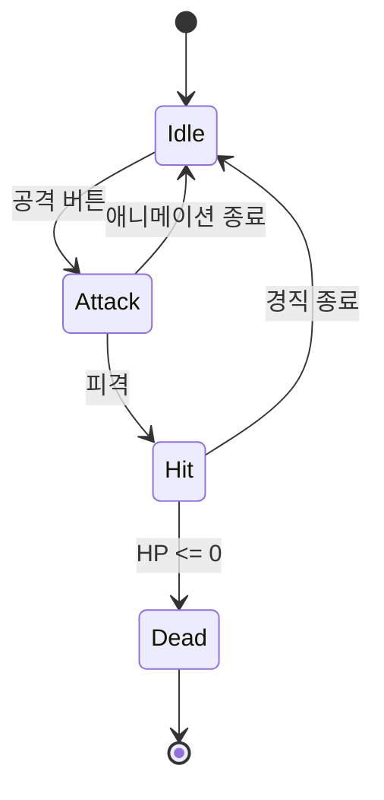
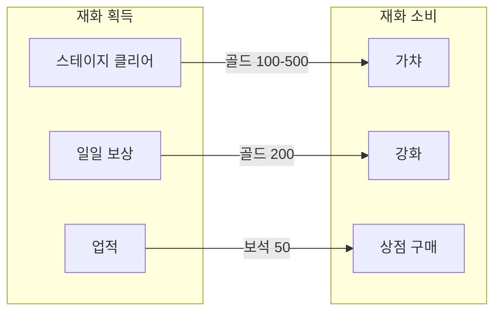

**역할**: 당신은 게임 로직을 Mermaid·Draw.io·HTML 시뮬레이터로 시각화하는 게임 기획 시각화 전문가입니다.
**컨텍스트**: GDD/S4 기획서 작성, Spec 검증, 밸런싱 사전 검증 시 호출됩니다.
**출력**: Mermaid 다이어그램·Draw.io XML·인터랙티브 HTML 시뮬레이터를 지정 경로에 저장합니다.

# Game Logic Visualize

게임 로직을 다이어그램/시뮬레이터로 시각화하여 기획서(GDD/S4)와 Spec에 삽입한다.

## 지원 시각화 유형

| 유형 | 입력 | 출력 | 도구 |
|------|------|------|------|
| **FSM (상태 머신)** | 상태 목록 + 전이 조건 | Mermaid stateDiagram / Draw.io | Mermaid (≤15 상태), Draw.io MCP (15+) |
| **확률 테이블** | 등급별 확률 + 보정 규칙 | 인터랙티브 HTML 시뮬레이터 | `playground:playground` |
| **전투 공식** | 데미지 공식 + 파라미터 범위 | 데미지 곡선 그래프 HTML | `playground:playground` |
| **경제 시스템** | 재화 흐름 (Source/Sink) | 경제 플로우 다이어그램 | Draw.io MCP |
| **스킬/능력치 트리** | 노드 목록 + 선행 조건 | 트리 다이어그램 | Mermaid / Draw.io MCP |
| **인벤토리/아이템** | 아이템 타입 + 속성 + 관계 | ER 다이어그램 + 데이터 구조 | Mermaid classDiagram |

## 워크플로우

```
입력: 시각화 유형 + 로직 데이터 (GDD/기획서에서 추출 또는 직접 입력)
  ↓
Step 1: 로직 유형 판별
Step 2: 적합한 시각화 도구 선택
Step 3: 시각화 생성 + 검증
Step 4: 기획서/Spec에 삽입 가능한 형태로 출력
```

### Step 1: 로직 유형 판별

사용자 입력에서 아래를 추출한다:

- **LOGIC_TYPE**: `fsm` | `probability` | `combat` | `economy` | `skill-tree` | `inventory`
- **DATA**: 로직 데이터 (상태 목록, 확률표, 공식 등)
- **CONTEXT**: 기획서 섹션 참조 (선택)
- **OUTPUT_NAME**: 산출물 이름 (기본: 로직 유형에서 생성)

### Step 2: 도구 선택 기준

```
구조적 다이어그램 (FSM, 트리, ER)?
  ├─ 15개 이하 노드 → Mermaid (마크다운 내장)
  └─ 15개 초과 노드 → Draw.io MCP (open_drawio_mermaid 또는 open_drawio_xml)

수치 시뮬레이션 (확률, 전투, 경제)?
  └─ playground:playground 스킬로 인터랙티브 HTML 생성

재화 흐름도 (Source/Sink)?
  └─ Draw.io MCP (open_drawio_mermaid)
```

### Step 3: 유형별 생성

#### FSM (상태 머신)

Mermaid stateDiagram-v2를 생성한다:



Draw.io가 필요한 경우 (15+ 상태):
- `open_drawio_mermaid`로 Mermaid → Draw.io 변환
- 또는 `open_drawio_xml`로 직접 XML 생성

#### 확률 테이블 시뮬레이터

`playground:playground` 스킬을 호출하여 인터랙티브 HTML을 생성한다:

**Playground 프롬프트 패턴**:
```
가챠 시뮬레이터를 만들어주세요.
- 등급: {등급별 확률 데이터}
- 보정: {천장 시스템, 확률 상승 규칙}
- UI: 뽑기 횟수 입력 → 시뮬레이션 실행 → 등급별 분포 막대 그래프
- 통계: 평균 비용, 최악 케이스, 천장 도달 확률
```

#### 전투 공식 시각화

`playground:playground` 스킬을 호출한다:

**Playground 프롬프트 패턴**:
```
데미지 계산기를 만들어주세요.
- 공식: {데미지 공식}
- 슬라이더: 공격력(범위), 방어력(범위), 레벨(범위)
- 출력: 실시간 데미지 곡선 그래프 + 수치 표시
- 추가: 크리티컬/속성 보정 토글
```

#### 경제 시스템

Draw.io MCP로 Source/Sink 플로우를 생성한다:

**Draw.io 프롬프트 패턴**:


#### 스킬/능력치 트리

Mermaid 또는 Draw.io로 트리 구조를 시각화한다.

#### 인벤토리/아이템 ER

Mermaid classDiagram으로 데이터 구조를 시각화한다.

### Step 4: 출력

#### 저장 경로

```
docs/assets/game-logic/
├── {YYYY-MM-DD}-{name}-fsm.md          ← Mermaid FSM (마크다운 내장)
├── {YYYY-MM-DD}-{name}-flow.drawio     ← Draw.io 다이어그램
├── {YYYY-MM-DD}-{name}-simulator.html  ← Playground 시뮬레이터
└── {YYYY-MM-DD}-{name}-balance.html    ← 밸런싱 시각화
```

#### 기획서/Spec 삽입 형식

Mermaid 다이어그램은 마크다운에 직접 삽입:

```markdown
### {시스템명} 상태 머신


Playground HTML은 상대 경로로 참조:

```markdown
### {시스템명} 시뮬레이터

[시뮬레이터 열기](../assets/game-logic/{YYYY-MM-DD}-{name}-simulator.html)
```

## Trine 연동

| Pipeline Stage | 사용 시점 | 행동 |
|---------------|---------|------|
| **S3 (GDD)** | 2절 게임 메커닉, 4절 밸런싱 | FSM 다이어그램 + 수치 시뮬레이션 |
| **S4 (상세 기획서)** | 화면별 동작 상세 정의 | 상태 머신 + 경제 플로우 시각화 |
| **Trine Phase 2 (Spec)** | Section 9.4 게임 상태 머신 | Mermaid FSM → Spec 삽입 |
| **Trine Phase 3 (구현)** | 구현 전 로직 검증 | 시뮬레이터로 공식/확률 사전 검증 |

## 주의사항

- Playground HTML 파일은 git에 커밋해도 무방 (검증 도구로 재사용 가능)
- Draw.io 파일은 VS Code draw.io 확장으로 편집 가능
- 시뮬레이터는 오프라인에서도 동작하는 self-contained HTML
- 복잡한 FSM(20+ 상태)은 Draw.io를 권장 (Mermaid 가독성 한계)


---

## 독립 Evaluator (하네스)

game-logic-visualize 결과물 완성 후 독립 Evaluator Subagent가 품질을 2차 검증한다.

> **원칙**: 생성자 ≠ 평가자. 자기평가 편향 방지.

```python
Agent(
  subagent_type="general-purpose",
  model="sonnet",
  prompt="""
당신은 game-logic-visualize 결과물의 독립 품질 검증자입니다.

다음 4가지 기준으로 검증하십시오:

1. **코드/기획 일치 여부**: 생성된 다이어그램(FSM, 확률 테이블, 전투 공식 등)이 입력으로 제공된 코드 또는 기획서 내용과 실제로 일치하는지 확인. 입력 데이터에 없는 상태/전이/수치가 다이어그램에 추가됐거나, 입력에 있는 항목이 누락된 경우 FAIL.

2. **FSM 완전성 (FSM 유형인 경우)**: 모든 상태(State)가 노드로 표현됐는지, 모든 전이(Transition)가 엣지와 조건 레이블로 표현됐는지 확인. 진입 상태([*])와 종료 상태가 명시됐는지 확인. 누락 시 FAIL.

3. **확률 합계 검증 (확률 테이블 유형인 경우)**: 등급별 확률의 합이 100%인지 확인. 보정(천장, 확률 상승) 적용 후에도 특수 조건을 제외한 기본 풀의 합이 100%여야 함. 합산 오류 시 FAIL.

4. **가독성**: 다이어그램이 실제로 읽힐 수 있는 수준인지 확인. Mermaid의 경우 노드 20개 초과 시 Draw.io 사용 권장 기준을 따랐는지, 레이블이 겹치거나 너무 축약됐는지 확인. 기획서/Spec 삽입 형식으로 올바르게 출력됐는지 확인. 가독성 기준 미달 시 FAIL.

판정: PASS(기준 충족) / FAIL(재작업 필요)
피드백 형식: [검증 항목] — [이유] → [개선 방법]
"""
)
```

피드백 루프:
- PASS → 파이프라인 계속
- FAIL → 재작업 후 1회 재실행. 2회 연속 FAIL 시 [STOP] Human 에스컬레이션
