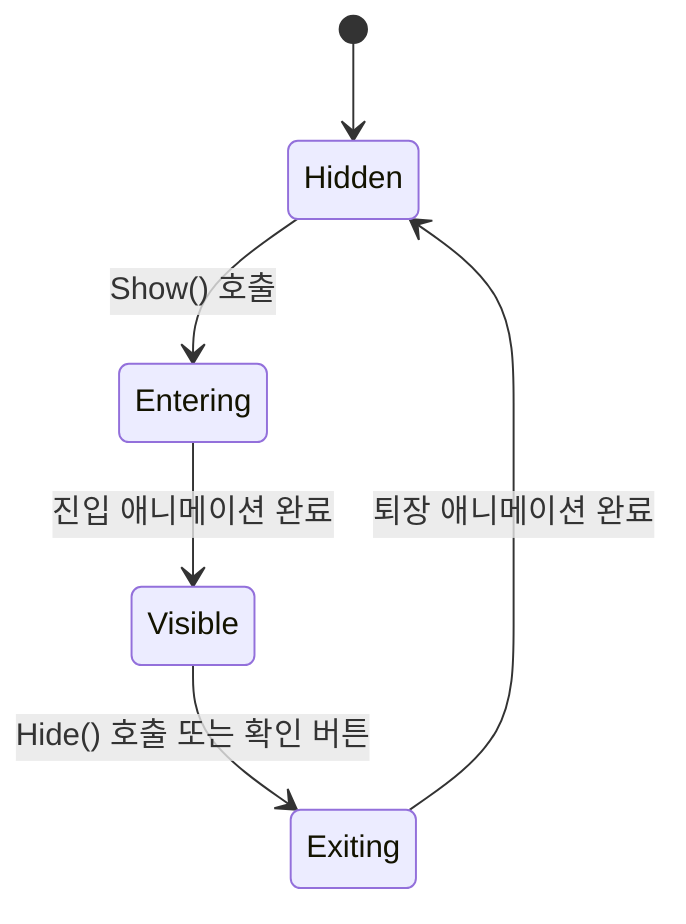

<!-- Element Task Doc: 연출/UI 상세 명세 -->
<!-- 상위 Spec의 Section 9.5/9.9에서 Complex 판정된 요소만 분리 작성 -->
<!-- 유형: [연출 전용] = 섹션 5,14만 작성 / [UI 전용] = 섹션 7-12만 작성 / [복합] = 모두 작성 -->
<!-- 저장 경로: .specify/element-tasks/{spec-name}/{element-name}.md -->

# [요소명] Element Task Doc

---

## 1. 개요 [공통]

### 1.1 요소명

[요소명]

### 1.2 유형

> [작성 가이드] 아래 중 하나를 선택한다.

- [ ] 연출 (애니메이션/파티클/카메라/셰이더)
- [ ] UI 컴포넌트 (패널/팝업/인터랙티브 요소)
- [ ] 연출+UI 복합

### 1.3 상위 Spec 참조

> [작성 가이드] 이 Element Task Doc이 분리된 원본 Spec과 섹션을 명시한다.

| 항목 | 내용 |
|------|------|
| Spec 경로 | `.specify/{spec-name}.md` |
| 참조 섹션 | Section [번호] — [섹션 제목] |
| 연관 FR | FR-[ID] |
| 분리 사유 | [Complex 판정 근거: 분기 조건 N개 / 파티클 모듈 복잡 / 상태 N개 이상 등] |

### 1.4 목적

> [작성 가이드] 이 요소가 플레이어/사용자에게 전달하는 가치를 1-2문장으로 기술한다.

[예: SSR 등급 획득 시 임팩트 있는 연출로 획득 감동을 극대화한다.]

---

## 2. 트리거 조건 [공통]

> [작성 가이드] 이 요소가 재생/표시되는 모든 트리거를 나열한다. 트리거 누락 시 연출이 발동되지 않거나 중복 발동될 수 있다.

| 트리거 | 소스 | 선행 조건 | 비고 |
|--------|------|----------|------|
| [예: 가챠 결과 수신] | 시스템 이벤트 (서버 응답) | 로딩 연출 완료 | — |
| [예: 확인 버튼 탭] | 유저 입력 | 결과 표시 완료 | 스킵 겸용 |
| [예: SSR 등급 판정] | 상태 전이 (GachaState.Result) | 결과 데이터 유효 | 등급 분기 진입점 |

---

## 3. 타임라인 시퀀스 [공통]

> [작성 가이드] 이 테이블이 DOTween Sequence의 Append/Join/Insert와 1:1 매핑되어야 한다. 관계 컬럼의 After/With/Delay는 Sequence 구성 방식에 직접 대응된다.

```mermaid
gantt
    title [요소명] 타임라인
    dateFormat  s
    axisFormat  %Ss

    section [그룹 1]
    [액션 A]  : 0, 0.3s
    [액션 B]  : 0.3, 0.5s

    section [그룹 2]
    [액션 C]  : 0.3, 0.8s
    [액션 D]  : 0.8, 0.4s
```



| # | 시작(s) | 종료(s) | 대상 | 액션 | 파라미터 | 관계 |
|:-:|:------:|:------:|------|------|----------|------|
| [예: 1] | [0.0] | [0.3] | [배경 오버레이] | [FadeIn] | [Alpha 0→0.8] | — |
| [예: 2] | [0.3] | [0.8] | [카드 오브젝트] | [ScaleUp] | [Scale 0→1, EaseOutBack] | After #1 |
| [예: 3] | [0.3] | [0.6] | [파티클_Burst] | [Play] | [emissionCount=50] | With #2 |

---

## 4. 트윈 파라미터 [공통]

> [작성 가이드] 추상적 서술 금지 (forge-spec-visual-binding.md C-1). '부드럽게' → 'EaseInOutSine, 0.3s'. 모든 트윈은 측정 가능한 수치로 기재한다.

| 대상 | Property | From | To | Duration(s) | Ease | Delay(s) | Loop | 비고 |
|------|----------|------|----|:-----------:|------|:--------:|------|------|
| [예: CardRoot] | Scale | (0, 0, 0) | (1, 1, 1) | 0.5 | EaseOutBack | 0.3 | — | 시퀀스 #2 |
| [예: GlowSprite] | Alpha | 0 | 1 | 0.3 | EaseInOutSine | 0.4 | 2회 / Yoyo | 루프 후 Kill |
| [예: BackgroundPanel] | Color | #000000 | #1A1A2E | 0.4 | Linear | 0.0 | — | CanvasGroup 불가 시 Image.color 사용 |

---

## 5. 파티클 시스템 설정 [연출 전용]

> [작성 가이드] 해당 없으면 "N/A" 기재 후 스킵. 파티클이 있는 경우 최소 Main, Emission, Shape 3개 모듈은 필수 기재한다.

### 5.1 [파티클명 1] — [예: Burst_SSR]

> [작성 가이드] 해당 없으면 "N/A" 기재 후 스킵.

| 모듈 | 설정 항목 | 값 |
|------|----------|-----|
| Main | Duration | [예: 1.5s] |
| Main | Loop | [예: false] |
| Main | Start Lifetime | [예: 0.5 ~ 1.0 (Random)] |
| Main | Start Speed | [예: 3.0 ~ 6.0 (Random)] |
| Main | Start Size | [예: 0.1 ~ 0.3 (Random)] |
| Main | Start Color | [예: Gradient (#FFD700 → #FF6B00)] |
| Main | Max Particles | [예: 200] |
| Emission | Rate over Time | [예: 0] |
| Emission | Bursts | [예: Time 0.0, Count 100, Cycles 1] |
| Shape | Shape | [예: Sphere] |
| Shape | Radius | [예: 0.5] |
| Color over Lifetime | Color | [예: Alpha 1→0 (Linear)] |
| Size over Lifetime | Size | [예: 1→0 (EaseIn)] |
| Renderer | Render Mode | [예: Billboard] |
| Renderer | Material | [예: Particles/Additive] |
| Renderer | Order in Layer | [예: 10] |

### 5.2 [파티클명 2] — [예: Trail_Star]

> [작성 가이드] 파티클이 추가로 있으면 5.2, 5.3... 섹션을 반복한다.

| 모듈 | 설정 항목 | 값 |
|------|----------|-----|
| Main | Duration | [N/A 또는 값] |
| Emission | Rate over Time | [N/A 또는 값] |
| Shape | Shape | [N/A 또는 값] |

---

## 6. 분기 조건표 [공통]

> [작성 가이드] 등급별/레벨별/상태별로 연출 파라미터가 달라지는 경우 반드시 작성한다. 모든 등급/조건의 차이를 누락 없이 기재한다. 해당 없으면 "N/A" 기재 후 스킵.

| 분기 키 | 분기 값 | 영향 파라미터 | 변경 값 |
|--------|--------|-------------|--------|
| [예: 획득 등급] | N | 파티클 수 / Duration / 배경 색상 | emissionCount=20 / 0.5s / #1A1A2E |
| [예: 획득 등급] | R | 파티클 수 / Duration / 배경 색상 | emissionCount=50 / 1.0s / #1A2E1A |
| [예: 획득 등급] | SR | 파티클 수 / Duration / 배경 색상 | emissionCount=120 / 1.8s / #1A1A40 |
| [예: 획득 등급] | SSR | 파티클 수 / Duration / 배경 색상 | emissionCount=250 / 3.0s / #2E1A00 |

---

## 7. Prefab 계층 구조 [UI 전용]

> [작성 가이드] 해당 없으면 "N/A" 기재 후 스킵. UI 프레임워크를 명시하고 혼용 금지.

**UI 프레임워크**: [ ] uGUI (Canvas 기반)  /  [ ] NGUI (UIRoot 기반)  /  [ ] UI Toolkit

```
[예: GachaResultPanel (Canvas)]
├── [Background] — Image (RawImage, 블러 배경)
├── [ContentGroup] — VerticalLayoutGroup
│   ├── [TitleLabel] — TextMeshProUGUI — "획득 결과"
│   ├── [CardSlotGrid] — GridLayoutGroup
│   │   ├── [CardSlot_0] — CardSlotView (MonoBehaviour)
│   │   └── [CardSlot_N] — CardSlotView (반복)
│   └── [ButtonGroup] — HorizontalLayoutGroup
│       ├── [BtnConfirm] — Button — "확인"
│       └── [BtnShare] — Button — "공유"
└── [OverlayParticle] — ParticleSystem (World Space)
```

| 오브젝트 | 컴포넌트 | 역할 | Anchor Min | Anchor Max | Pivot |
|---------|---------|------|:----------:|:----------:|:-----:|
| [예: ContentGroup] | VerticalLayoutGroup | 수직 정렬 | (0, 0) | (1, 1) | (0.5, 0.5) |
| [예: BtnConfirm] | Button + TextMeshProUGUI | 확인/닫기 | (0, 0) | (0.5, 1) | (0.5, 0.5) |
| [예: OverlayParticle] | ParticleSystem | 등급별 이펙트 | (0.5, 0.5) | (0.5, 0.5) | (0.5, 0.5) |

---

## 8. 상태 정의 [UI 전용]

> [작성 가이드] 해당 없으면 "N/A" 기재 후 스킵. UI 요소의 가시성/상호작용 상태를 모두 정의한다.



| 상태명 | 활성 요소 | 비활성 요소 | 입력 허용 | 전환 조건 |
|--------|---------|-----------|:--------:|----------|
| Hidden | — | 모든 오브젝트 | 없음 | Show() 호출 |
| Entering | 전체 (트랜지션 중) | BtnConfirm, BtnShare | 없음 | 진입 애니메이션 완료 |
| Visible | 전체 | — | 전체 허용 | Hide() / 확인 버튼 |
| Exiting | 전체 (트랜지션 중) | BtnConfirm, BtnShare | 없음 | 퇴장 애니메이션 완료 |

---

## 9. 진입/퇴장 애니메이션 [UI 전용]

> [작성 가이드] 해당 없으면 "N/A" 기재 후 스킵. CanvasGroup.interactable = false / blocksRaycasts = false를 트랜지션 중에 적용한다.

| 방향 | 대상 | Property | From | To | Duration(s) | Ease |
|:----:|------|----------|------|----|:-----------:|------|
| 진입 | [예: ContentGroup] | Position Y | -200 | 0 | 0.4 | EaseOutCubic |
| 진입 | [예: CanvasGroup] | Alpha | 0 | 1 | 0.3 | Linear |
| 퇴장 | [예: ContentGroup] | Position Y | 0 | 200 | 0.3 | EaseInCubic |
| 퇴장 | [예: CanvasGroup] | Alpha | 1 | 0 | 0.3 | Linear |

---

## 10. 디자인 토큰 바인딩 [UI 전용]

> [작성 가이드] 해당 없으면 "N/A" 기재 후 스킵. forge-spec-visual-binding.md A-2 준수. 모든 색상/간격/폰트 수치는 토큰으로 참조한다.

| 요소 | 토큰명 | 값 | 출처 |
|------|-------|-----|------|
| [예: TitleLabel] | color-text-primary | #FFFFFF | 스타일 가이드 S.3 |
| [예: BtnConfirm] | color-primary | #0095F6 | `shared/design-tokens/instagram-default.json` |
| [예: Background] | color-surface-overlay | rgba(0,0,0,0.8) | 스타일 가이드 S.7 |
| [예: ContentGroup] | spacing-lg | 24px | 스타일 가이드 S.10 |
| [예: TitleLabel] | font-heading | SF Pro Display Bold 20pt | 스타일 가이드 S.5 |

---

## 11. 인터랙션 피드백 [UI 전용]

> [작성 가이드] 해당 없으면 "N/A" 기재 후 스킵. 시각/청각/촉각 피드백을 모두 기재한다. 피드백 없는 인터랙션은 "없음" 명시.

| UI 요소 | 인터랙션 | 시각 피드백 | 청각 피드백 | 촉각 피드백 | 파라미터 |
|--------|---------|-----------|-----------|-----------|--------|
| [예: BtnConfirm] | 탭 (Press) | Scale 1→0.95, 밝기 -10% | SE_btn_click | Haptic Light | Duration 0.1s, EaseInOut |
| [예: BtnConfirm] | 탭 (Release) | Scale 0.95→1 | — | — | Duration 0.1s, EaseOutBack |
| [예: CardSlot] | 탭 | Scale 1→1.05→1 | SE_card_select | Haptic Medium | Duration 0.2s |
| [예: BtnShare] | 롱프레스 (0.5s) | 컬러 강조 + 진동 효과 | SE_btn_longpress | Haptic Heavy | Threshold 0.5s |

---

## 12. 동적 데이터 바인딩 [UI 전용]

> [작성 가이드] 해당 없으면 "N/A" 기재 후 스킵. 런타임에 갱신되는 UI 요소와 데이터 소스를 1:1로 매핑한다.

| UI 요소 | 데이터 소스 | 갱신 조건 | 포맷팅 | Overflow 처리 |
|--------|-----------|----------|--------|-------------|
| [예: CurrencyLabel] | UserData.gem | OnGemChanged 이벤트 | ToString("N0") — 1,000 단위 콤마 | TextMeshPro Truncate + "..." |
| [예: CardNameLabel] | ItemData.displayName | 카드 표시 시 1회 | 직접 표시 | 최대 12자, Truncate |
| [예: GradeIcon] | ItemData.grade | 카드 표시 시 1회 | Enum → Sprite 매핑 | Fallback: 기본 아이콘 |
| [예: OwnedCountLabel] | InventoryData.GetCount(itemId) | OnInventoryChanged 이벤트 | "보유 {0}개" 포맷 | 최대 9999, 이상은 "9999+" |

---

## 13. 사운드 싱크 포인트 [공통]

> [작성 가이드] 해당 없으면 "N/A" 기재 후 스킵. Section 3 타임라인 시퀀스의 # 번호를 참조하여 사운드와 1:1 매핑한다.

| 시퀀스 # | 사운드 ID | 시작 시점(s) | 볼륨 | 페이드 In/Out(s) | 기존 BGM 처리 |
|:-------:|---------|:-----------:|:----:|:--------------:|------------|
| [예: 1] | SE_overlay_appear | 0.0 | 0.6 | In 0.1 / — | 유지 |
| [예: 2] | SE_card_spawn | 0.3 | 1.0 | — / — | 유지 |
| [예: 3, SSR 분기] | BGM_ssr_fanfare | 0.3 | 0.9 | In 0.2 / Out 0.5 | 기존 BGM 0.3s 페이드아웃 후 교체 |

---

## 14. 카메라/셰이더 [연출 전용, 해당 시]

> [작성 가이드] 카메라 연출 또는 Post Processing/셰이더 효과가 없으면 "N/A" 기재 후 스킵.

### 14.1 카메라 연출

| 연출 | 카메라 액션 | 파라미터 | Duration(s) | Ease |
|------|-----------|---------|:-----------:|------|
| [예: SSR 등장 시] | Shake | Strength (0.3, 0.3, 0), Vibrato 10, Randomness 90 | 0.4 | — |
| [예: 카드 확대] | Zoom (FOV) | FOV 60→45 | 0.6 | EaseInOutQuad |

### 14.2 셰이더 / Post Processing

| 이펙트 | 타입 | 파라미터 | From | To | Duration(s) |
|--------|------|---------|------|----|:-----------:|
| [예: SSR 등장] | Bloom | Intensity | 0.5 | 3.0 | 0.3 |
| [예: SSR 등장] | Vignette | Intensity | 0.0 | 0.4 | 0.3 |
| [예: 결과 확정] | Color Grading | Saturation | 0 | 20 | 0.5 |

---

## 15. 스킵/중단 처리 [공통]

> [작성 가이드] 스킵 시 DOTween.Kill(complete: true)로 최종 상태 전환 권장. 자세한 패턴은 forge-direction-ui-implementation-guide.md Section 7 참조.

| 스킵 시점 | 허용 입력 | 스킵 후 상태 | 리소스 정리 | 결과 처리 |
|---------|---------|------------|-----------|---------|
| [예: 진입 트랜지션 중] | — (스킵 불가) | 스킵 불가 구간 | N/A | N/A |
| [예: 연출 재생 중 (Entering→Visible)] | 화면 탭 | Visible 상태로 즉시 전환 | DOTween.Kill(complete: true), 파티클 Stop+Clear | 연출 결과 상태 확정 후 표시 |
| [예: 결과 표시 중] | 확인 버튼 / 뒤로가기 / ESC | Hidden 상태로 전환 | 트윈 Kill, 파티클 Stop, 사운드 StopAll, 코루틴 StopAllCoroutines | 정상 종료 처리 |

---

## 16. 레퍼런스 바인딩 [공통]

> [작성 가이드] /video-reference-guide 또는 /screenshot-analyze 분석 결과를 여기에 삽입한다. 레퍼런스 없이 작성 금지는 아니나, 있는 경우 반드시 연결한다.

| 레퍼런스 유형 | 원본 경로 | 참고 구간/슬라이드 | 적용 대상 | 분석 결과 요약 |
|------------|---------|----------------|---------|-------------|
| [예: 영상] | [forge-outputs/01-research/video-refs/A사_가챠.mp4] | [00:05-00:12] | [카드 오픈 연출 — 시퀀스 #2] | [스케일 바운스 + 파티클 Burst 동시. Duration 약 0.5s] |
| [예: 스크린샷] | [forge-outputs/01-research/screenshots/B사_SSR연출.png] | [전체] | [SSR 배경 오버레이 — 섹션 6 분기] | [배경 색상 등급별 차등, Bloom 강도 차이 뚜렷] |
| [예: 기획서] | [forge-outputs/02-product/s3-gdd.pptx] | [슬라이드 22-25] | [디자인 토큰 바인딩 — 섹션 10] | [컬러 팔레트, 등급 아이콘 스펙 확정] |

### 16-1. 시안 이미지 바인딩

> [작성 가이드] `_assets/` 시안(디자인 목업)이 존재하면 **필수 작성**. 시안의 각 시각 요소를 이 Task Doc의 구체적 섹션/파라미터에 1:1 매핑한다.
> 시안에서 추출한 값은 `(확정)` 태그 — 디자인 의도이므로 추정이 아님.
> 시안이 없는 요소는 `(추정)` 태그.
> 시안 분석은 `/screenshot-analyze --mockup` 모드로 실행한다 (확정값 전용).

| 시안 경로 | 시안 내 요소 | 매핑 대상 섹션 | 매핑 파라미터 | 확정값 |
|----------|-----------|-------------|-----------|:-----:|
| [예: _assets/gacha-main.png] | [구매 버튼 배경색] | Section 10 | color-primary | #0095F6 (확정) |
| [예: _assets/gacha-main.png] | [카드 뒷면 테두리] | Section 10 | color-grade-ssr | #FFD700 (확정) |
| [예: _assets/gacha-main.png] | [카드 크기] | Section 7 | Card RectTransform | 280×400 (확정) |
| [예: _assets/gacha-open.png] | [카드 플립 최종 상태] | Section 4 | RotationY To | 180° (확정) |
| [예: _assets/gacha-open.png] | [파티클 색상 SSR] | Section 5 | StartColor (SSR) | #FFD700 (확정) |

> [작성 가이드] 이 테이블이 완성되면, 구현자는 시안 원본을 열지 않아도 모든 시각 파라미터를 Task Doc만으로 작업할 수 있어야 한다.
> 시안 바인딩이 없는 Element Task Doc은 `_assets/` 시안 존재 시 E-1 검증 게이트에서 FAIL 판정된다.

---

## 17. 에셋 목록 [공통]

> [작성 가이드] 이 요소 구현에 필요한 모든 에셋을 나열한다. 재활용 에셋은 기존 경로, 신규 에셋은 예상 경로를 기재한다.

| 에셋 | 유형 | 크기/스펙 | 상태 | 경로 |
|------|------|---------|:----:|------|
| [예: Burst_SSR.prefab] | Prefab (ParticleSystem) | — | 신규 제작 | `Assets/Effects/Gacha/Burst_SSR.prefab` |
| [예: card_reveal.anim] | Animator Clip | 0.8s, 24fps | 신규 제작 | `Assets/Animations/Gacha/card_reveal.anim` |
| [예: SE_ssr_fanfare.wav] | Sound | Stereo, 44.1kHz, < 500KB | 신규 제작 | `Assets/Audio/SE/SE_ssr_fanfare.wav` |
| [예: img_grade_ssr.png] | Sprite | 128×128, RGBA | 기존 재활용 | `Assets/UI/Sprites/Grades/img_grade_ssr.png` |
| [예: Mat_Additive.mat] | Material | Particles/Additive | 기존 재활용 | `Assets/Materials/Particles/Mat_Additive.mat` |

---

## 18. 성능 예산 [공통]

> [작성 가이드] 플랫폼별 전체 예산 중 이 요소가 차지하는 예산을 정의한다. 전체 예산 기준은 forge-direction-ui-implementation-guide.md Section 8 참조.

| 항목 | 이 요소의 예산 | 측정 방법 |
|------|-------------|---------|
| Draw Call | [예: + 5 (파티클 Renderer 포함)] | Unity Frame Debugger — 연출 재생 중 |
| 파티클 수 | [예: 최대 250개 (SSR 분기)] | Unity Profiler → Particles |
| 메모리 (에셋) | [예: < 30MB (텍스처+Prefab 합산)] | Memory Profiler → Texture/Mesh |
| GC Alloc / frame | [예: < 1KB/frame (연출 중)] | Unity Profiler Deep Profile |
| 트윈 인스턴스 | [예: 최대 8개 동시] | DOTween Inspector |

---

## 19. 완료 조건 [공통]

> [작성 가이드] 구현 완료 판정 기준이다. 모든 항목이 체크되어야 이 Element Task가 완료된다.

- [ ] 타임라인 시퀀스 (Section 3) 모든 스텝 구현 완료
- [ ] 트윈 파라미터 (Section 4) 수치 일치 확인
- [ ] 분기 조건 (Section 6) 모든 경우의 수 동작 확인
- [ ] 사운드 싱크 포인트 (Section 13) 타이밍 일치
- [ ] 스킵/중단 처리 (Section 15) 정상 동작 확인 (리소스 정리 포함)
- [ ] 성능 예산 (Section 18) 이내 측정 확인
- [ ] 레퍼런스 (Section 16) 와 비교 검수 완료
- [ ] [연출 전용] 파티클 모든 분기 등급에서 정상 재생
- [ ] [UI 전용] 진입/퇴장 트랜지션 중 입력 차단 확인
- [ ] [UI 전용] 디자인 토큰 (Section 10) 수치 일치 확인
- [ ] [UI 전용] 동적 데이터 바인딩 (Section 12) 갱신 시나리오 확인
- [ ] (필요 시 추가)

---

## 20. 의존성 [공통]

> [작성 가이드] 이 요소 구현 시작 전에 완료되어야 하는 선행 항목을 모두 기재한다. 상태가 "미착수"인 항목은 구현 블로커이므로 별도 태스크로 등록한다.

| 의존 대상 | 유형 | 상태 | 비고 |
|---------|------|:----:|------|
| [예: GachaResultSpec.md] | 상위 Spec | 완료 | FR-07, FR-08 확정 필요 |
| [예: GradeIconSheet.png] | 에셋 | 진행중 | 디자이너 작업 중 |
| [예: SE_ssr_fanfare.wav] | 에셋 | 미착수 | 사운드 디자이너 미배정 |
| [예: GachaResultResponse 프로토콜] | 서버 API | 완료 | Spec Section 6 참조 |
| [예: BurstEffect_Base Element Task] | 선행 Task Doc | 미착수 | 공유 파티클 Prefab 의존 |
