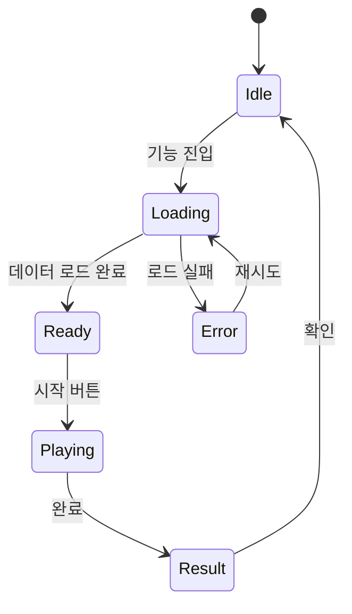
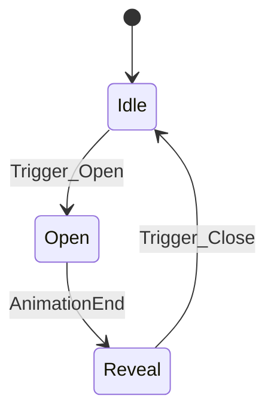

<!-- Spec 크기 가드레일: 700-900줄 적정 / 1,200줄 경고 / 1,500줄+ 분리 필수 -->
<!-- SP 가드레일: 5-8 SP 적정 / 10 SP 경고 / 12+ 분리 필수 -->
<!-- 1 Spec = 1 Feature (하나의 사용자 가치). 2기능 번들 시 분리 불가 사유 명시 필수 -->

# [기능명] 스펙 (게임)

## 1. 개요
### 1.1 목적
### 1.2 핵심 컨셉트

---

## 2. 기능 요구사항 (필수)
### 2.1 [주요 기능 1]
### 2.2 [주요 기능 2]

---

## 3. 비기능 요구사항

> [작성 가이드] 각 NFR에 측정 가능한 기준과 검증 방법을 명시한다. 기준이 모호하면 구현/검증 단계에서 누락된다.

### 3.1 성능

| 항목 | 측정 기준 | 목표값 | 검증 방법 |
|------|----------|--------|----------|
| FPS | 평균 프레임율 | [예: 60 fps (PC), 30 fps (Mobile)] | Unity Profiler |
| 프레임 드랍 | 1초 내 드랍 프레임 수 | [예: < 3 frames] | Unity Frame Debugger |
| 메모리 | 런타임 메모리 사용량 | [예: < 1.5GB (Mobile), < 4GB (PC)] | Memory Profiler |
| 에셋 로딩 | 씬 전환 시간 | [예: < 3초] | Addressables Profiler |
| 네트워크 지연 | RTT p95 | [예: < 200ms] | 서버 로그 |
| 패킷 크기 | 단일 요청/응답 크기 | [예: < 4KB] | Wireshark / 패킷 로그 |
| 배터리/발열 | 30분 연속 플레이 시 온도 | [예: < 40°C] | 실기기 테스트 |
| 드로콜 | 씬별 최대 Draw Call 수 | [예: < 100 (Mobile)] | Unity Frame Debugger |
| GC 할당 | 프레임당 GC Alloc | [예: < 1KB/frame] | Unity Profiler Deep Profile |

> [작성 가이드] 프로젝트 특성에 맞는 항목을 추가/제거한다. 목표값은 구체적 숫자로 명시한다.

### 3.2 보안

| 항목 | 측정 기준 | 목표값 | 검증 방법 |
|------|----------|--------|----------|
| 안티치트 | 메모리 변조 탐지 | 주요 값 변조 차단 100% | [예: 해시 비교, 서버 검증] |
| 패킷 검증 | 위변조 패킷 차단율 | 100% | [예: HMAC 서명 검증, 시퀀스 넘버] |
| 직렬화 무결성 | 직렬화/역직렬화 왕복 일치 | 100% | [예: 왕복 테스트, 프로젝트 직렬화 방식 기준] |
| 입력 검증 | 비정상 입력 차단 | 서버 측 전체 검증 | [예: 범위/타입/빈도 검증] |

### 3.3 확장성

| 항목 | 측정 기준 | 목표값 | 검증 방법 |
|------|----------|--------|----------|
| 동시 접속 | 서버당 동시 세션 수 | [예: 1000 CCU] | [예: 부하 테스트] |
| 데이터 증가 | 유저 데이터 N배 증가 시 성능 유지 | [예: 10배에서 응답 < 500ms] | [예: 시드 데이터 기반 테스트] |

### 3.4 가용성

| 항목 | 측정 기준 | 목표값 | 검증 방법 |
|------|----------|--------|----------|
| 업타임 | 서비스 가용률 | [예: 99.9%] | [예: 모니터링 대시보드] |
| 장애 복구 | 장애 후 복구 시간 (RTO) | [예: < 30분] | [예: 장애 시뮬레이션] |

> [작성 가이드] 프로젝트 규모에 따라 3.3, 3.4는 MVP에서 생략 가능. 생략 시 "MVP 범위 외" 명시.

---

## 4. 플레이어 플로우

> [작성 가이드] 각 주요 기능에 대해 Happy Path, Error Path, Edge Case를 분리하여 작성한다. 플로우 단계는 번호를 매기고, 각 단계에서 플레이어 액션과 시스템 반응을 명시한다.

### 4.1 [플로우명 1]

#### Happy Path (정상 흐름)

> [작성 가이드] 플레이어가 목표를 달성하는 가장 일반적인 경로를 단계별로 기술한다.

```
1. 플레이어: [액션]
   → 시스템: [반응]
2. 플레이어: [액션]
   → 시스템: [반응]
3. 완료 → [최종 결과]
```

#### Error Path (에러 흐름)

> [작성 가이드] 예상되는 에러 상황과 시스템의 에러 처리 방식을 기술한다. 플레이어에게 보이는 에러 메시지와 복구 경로를 포함한다.

| 에러 상황 | 발생 시점 | 시스템 반응 | 플레이어 복구 경로 |
|----------|----------|-----------|-----------------|
| [예: 네트워크 끊김] | [단계 N] | [재연결 시도 + 안내 팝업] | [자동 재연결 / 타이틀로 복귀] |
| [예: 재화 부족] | [단계 N] | [부족 알림 + 상점 안내] | [상점 이동 / 취소] |
| [예: 서버 타임아웃] | [단계 N] | [재시도 안내] | [재시도 / 메인 복귀] |

#### Edge Case (경계 조건)

> [작성 가이드] 정상도 에러도 아닌 경계 상황을 기술한다. 동시 입력, 빈 데이터, 극단값 등.

| 경계 상황 | 기대 동작 |
|----------|----------|
| [예: 연출 중 뒤로가기] | [연출 스킵 후 결과 표시] |
| [예: 동시에 같은 아이템 사용] | [첫 요청만 처리, 중복 차단] |
| [예: 재화 최대치 초과 획득] | [최대치까지만 적용 + 알림] |

### 4.2 [플로우명 2]

> [작성 가이드] 주요 기능별로 4.1과 동일한 구조를 반복한다.

---

## 5. 데이터 모델

> C# 클래스/구조체로 정의한다. 서버-클라이언트 공유 모델은 직렬화 방식을 명시한다.

> [작성 가이드] 프로젝트의 데이터 파이프라인 구조에 따라 레이어를 정의한다.
> 프로젝트마다 아키텍처가 다를 수 있으므로, 실제 사용하는 레이어만 기재한다.
>
> | 레이어 | 역할 | 네이밍 패턴 | 예시 |
> |--------|------|-----------|------|
> | [Data/Model] | 단일 레코드 모델 | [프로젝트 네이밍 규칙] | [예: ShopGachaData.cs] |
> | [DAO/Repository] | 직렬화/역직렬화, DB 접근 | [프로젝트 네이밍 규칙] | [예: ShopGachaDao.cs] |
> | [Table/Collection] | 여러 레코드 배열 | [프로젝트 네이밍 규칙] | [예: ShopGachaTable.cs] |
> | [Store/Cache] | 런타임 캐시, 접근 인터페이스 | [프로젝트 네이밍 규칙] | [예: DataManager.ShopGacha] |
>
> **직렬화 필수 체크리스트**:
> - [ ] 서버-클라이언트 공유 모델은 프로젝트 직렬화 방식 적용 (섹션 6 참조)
> - [ ] 왕복 테스트 (객체 → 바이트 → 객체) 일치 확인
> - [ ] 민감 데이터(확률, 재화) 서버 측 계산, 클라이언트는 표시만

---

## 6. 프로토콜/API

> [작성 가이드] 게임 서버와의 통신 프로토콜을 정의한다. 기존 프로토콜 재사용 시 "기존" 표기.

| 프로토콜 | 방향 | 설명 | 직렬화 | 기존/신규 |
|---------|------|------|--------|:--------:|
| [예: BuyGacha] | C→S | 가챠 구매 요청 | [직렬화 방식] | 기존 |
| [예: BuyGachaResult] | S→C | 가챠 결과 응답 | [직렬화 방식] | 기존 |
| [예: GetHistory] | C→S | 히스토리 조회 | [직렬화 방식] | 신규 |

> [직렬화 방식 선택 가이드] 프로젝트에서 사용하는 방식에 맞게 아래를 수정한다.
> | 방식 | 사용 시점 | 예시 |
> |------|---------|------|
> | [프로젝트 전용 방식] | 게임 핵심 데이터 (재화, 아이템, 등급) — 안티치트 필수 | [주요 API] |
> | JSON | 로그, 설정, 관리 도구 연동 (보안 불필요) | 운영 툴 API |
> | Protobuf | 대용량 실시간 데이터 (해당 시) | — |
>
> **직렬화 구현 체크**:
> - [ ] Request 모델이 프로젝트 직렬화 방식을 상속/적용하는가?
> - [ ] Response는 서버 계산값만 신뢰하는가? (클라이언트 로컬 계산 금지)
> - [ ] 프로젝트별 직렬화 패턴은 Constitution 또는 `.specify/templates/spec-template-{project}.md` 참조

### 6.X 신규 프로토콜 상세

> [작성 가이드] 신규 프로토콜만 Request/Response 필드를 상세 정의한다. 기존 프로토콜은 기존 코드 참조.

```
[프로토콜명] Request:
  - [필드명]: [타입] — [설명] (필수/선택)

[프로토콜명] Response:
  - [필드명]: [타입] — [설명]
  - [직렬화 방식] 적용: [여부]
```

---

## 7. 보안 구현

### 7.1 안티치트

> [작성 가이드] 클라이언트 측 치트 방지 및 서버 측 검증 로직을 명시한다.

| 영역 | 위협 | 대응 | 검증 |
|------|------|------|------|
| [예: 재화 변조] | 메모리 에디터 | [예: 서버에서 재화 계산, 클라이언트는 표시만] | [서버 로그] |
| [예: 패킷 위변조] | 패킷 인터셉트 | [예: HMAC 서명 + 시퀀스 넘버] | [위변조 패킷 차단 테스트] |
| [예: 속도 핵] | 타임스케일 변조 | [예: 서버 시간 기준 검증] | [클라 시간 vs 서버 시간 비교] |

### 7.2 입력 검증

> [작성 가이드] 비ASCII 문자(한글, 이모지 등)를 허용하는 필드가 있으면 인코딩 왕복 시나리오를 명시한다.
> 해당 없으면 "해당 없음" 표기.

| 필드 | 허용 문자 | 검증 규칙 | 검증 방법 |
|------|---------|----------|---------|
| [필드] | [한글/영문/숫자/특수문자] | [길이 제한, 금칙어 필터] | Unit test |

---

## 8. 서버 연동

> [작성 가이드] 서버 로직 상세는 S3/S4 기획서에 정의되어 있으므로, 이 섹션에서는 클라이언트-서버 인터페이스만 정의한다.

### 8.1 서버 참조 문서

| 문서 | 경로 | 관련 섹션 |
|------|------|----------|
| [예: S3 GDD] | [symlink 경로] | [관련 챕터] |
| [예: S4 개발 계획] | [symlink 경로] | [서버 아키텍처] |

### 8.2 서버 연동 포인트

> [작성 가이드] 이 Spec의 기능에서 서버와 주고받는 데이터 흐름을 요약한다.

| 연동 포인트 | 프로토콜 | 트리거 | 응답 처리 |
|-----------|---------|--------|----------|
| [예: 가챠 구매] | BuyGacha | 구매 버튼 탭 | 결과 연출 → 인벤토리 갱신 |
| [예: 히스토리 조회] | GetPairHistory | 히스토리 팝업 열기 | 리스트 렌더링 |

### 8.3 Constitution 규칙 체크리스트

> [작성 가이드] 프로젝트의 Constitution(아키텍처 규칙)에서 서버 연동 관련 규칙을 체크한다.
> 해당 없는 항목은 "N/A"로 표기한다.

| 규칙 | 준수 여부 | 비고 |
|------|:--------:|------|
| 게임 핵심 데이터는 서버 계산 (클라이언트는 표시만) | ⬜ / ✅ / N/A | |
| 프로젝트 직렬화 방식 적용 (공유 모델) | ⬜ / ✅ / N/A | [예: DataPacking / Protobuf / JSON] |
| 안티치트: 메모리 변조 탐지 | ⬜ / ✅ / N/A | |
| 패킷 HMAC 서명 또는 시퀀스 넘버 | ⬜ / ✅ / N/A | |
| 재화/아이템 서버 검증 (클라이언트 신뢰 금지) | ⬜ / ✅ / N/A | |
| [프로젝트별 추가 규칙] | ⬜ / ✅ / N/A | |

> Constitution 파일 경로: `.specify/constitution.md` (프로젝트 루트)

---

## 9. 클라이언트 구현

> [작성 가이드] Unity 클라이언트 구현에 필요한 모든 정보를 정의한다.

### 9.1 씬 구조

> [작성 가이드] 이 기능에 관련된 씬 목록과 로딩 전략을 정의한다.

| 씬 이름 | 로딩 전략 | 전환 연출 | 유형 | 설명 |
|--------|----------|----------|:----:|------|
| [예: GachaScene] | Additive | 페이드 인/아웃 | 신규 / 수정 | [주요 목적] |

### 9.2 Prefab/Component 계층

> [작성 가이드] 주요 Prefab 트리와 MonoBehaviour 구성을 들여쓰기로 표현한다.
>
> [UI 프레임워크별 작성 가이드]
>
> **NGUI (UIRoot 기반)**:
> ```
> UIRoot (Screen Space)
> ├── UIPanel (레이어 격리)
> │   ├── UILabel — 텍스트
> │   ├── UISprite — 이미지
> │   ├── UIGrid / UITable — 리스트 레이아웃
> │   └── UIButton — 인터랙션
> ```
>
> **uGUI (Canvas 기반)**:
> ```
> Canvas (Screen Space - Overlay)
> ├── Panel (RectTransform)
> │   ├── Text (TextMeshPro)
> │   ├── Image (RawImage)
> │   ├── LayoutGroup (Grid/Horizontal/Vertical)
> │   └── Button
> ```
>
> 이 섹션에서 **어느 프레임워크를 사용하는지 명시**한다. 혼용 금지.

```
[씬/Prefab명]
├── [Root GameObject]
│   ├── [MonoBehaviour A] — [역할]
│   │   ├── [자식 오브젝트]
│   │   └── [자식 오브젝트]
│   └── [MonoBehaviour B] (공유 Prefab) — [역할]
└── [UI Canvas]
    ├── [Panel A]
    └── [Panel B]
```

### 9.3 핵심 MonoBehaviour 인터페이스

> [작성 가이드] 핵심 컴포넌트의 public 필드와 Inspector 설정을 정의한다.

```
[컴포넌트명]:
  - [필드명]: [타입] — [설명] (Inspector 노출 여부)
  - [필드명]: [타입] — [설명] (Inspector 노출 여부)
  주요 메서드:
  - [메서드명]([파라미터]): [반환] — [설명]
```

### 9.4 게임 상태 머신

> [작성 가이드] 이 기능의 상태 전이를 FSM으로 정의한다. Mermaid stateDiagram 사용을 권장한다.



| 상태 | 진입 조건 | 퇴출 조건 | 활성 오브젝트 |
|------|----------|----------|-------------|
| [Idle] | [초기/복귀] | [기능 진입] | [메인 UI만] |
| [Loading] | [서버 요청] | [응답 수신] | [로딩 UI] |
| [Playing] | [데이터 준비] | [완료/취소] | [게임 오브젝트] |

### 9.5 UI 상태

> [작성 가이드] Canvas 계층, UI 팝업, 에러/로딩 표시를 정의한다.

| UI 요소 | Canvas 레이어 | Sort Order | 로딩 상태 | 에러 상태 | 빈 상태 |
|--------|:------------:|:----------:|----------|----------|--------|
| [예: 메인 패널] | Default | 0 | [스켈레톤/스피너] | [에러 팝업 + 재시도] | [안내 메시지] |
| [예: 결과 팝업] | Popup | 100 | [로딩 애니메이션] | [에러 토스트] | — |

### 9.6 해상도/종횡비 대응

> [작성 가이드] Canvas Scaler 설정, Safe Area, 세로/가로 모드 대응을 정의한다.

| 항목 | 설정 |
|------|------|
| Canvas Scaler 모드 | [예: Scale With Screen Size] |
| Reference Resolution | [예: 1080 x 1920] |
| Match (Width/Height) | [예: 0.5] |
| Safe Area 대응 | [예: 노치/펀치홀 영역 회피] |
| 지원 종횡비 | [예: 16:9 ~ 20:9] |
| 가로 모드 | [지원/미지원] |

| 종횡비 | 레이아웃 변화 |
|--------|-------------|
| [예: 16:9 (태블릿)] | [예: 여백 추가, UI 스케일 조정] |
| [예: 20:9 (폴드)] | [예: Safe Area 적용, 상단 여백] |
| [예: 가로 모드] | [예: 2단 레이아웃 / 미지원] |

### 9.7 입력 처리

> [작성 가이드] 터치/키보드/게임패드 입력 매핑과 우선순위를 정의한다.

| 입력 | 플랫폼 | 동작 | 우선순위 |
|------|--------|------|:--------:|
| [예: 화면 탭] | Mobile | [탭한 위치의 오브젝트 선택] | 1 |
| [예: 스와이프] | Mobile | [리스트 스크롤] | 2 |
| [예: 마우스 클릭] | PC | [오브젝트 선택] | 1 |
| [예: ESC 키] | PC | [팝업 닫기 / 뒤로가기] | 1 |

> [작성 가이드] 입력 충돌 시 처리 규칙도 명시한다 (예: 연출 중 입력 차단).

### 9.8 로컬라이제이션

> [작성 가이드] Unity Localization 패키지 사용 시 키와 언어 파일을 정의한다.
> 로컬라이제이션 미적용 시 "해당 없음" 표기 후 스킵.

#### 신규/수정 메시지 키

| 작업 | 테이블 | 키 | 기본값 (주 언어) | 비고 |
|:----:|--------|-----|----------------|------|
| 추가 | [예: UI] | [예: gacha_title] | [예: "가챠 뽑기"] | [신규 화면] |

#### 메시지 파일 변경 목록

| 파일 경로 | 언어 | 변경 유형 |
|----------|:----:|:--------:|
| [예: Localization/ko/UI.asset] | ko | 추가 |
| [예: Localization/en/UI.asset] | en | 추가 |

### 9.9 연출/이펙트 스펙

> [작성 가이드] 파티클, 셰이더, 트윈 시퀀스, 사운드 트리거, 타임라인 등 연출 요소를 정의한다.
> [작성 가이드] 구현 가이드 컬럼에 프로젝트에서 사용하는 트윈 라이브러리를 명시한다.
> - Unity 신규 프로젝트: DOTween Sequence 권장
> - NGUI 기존 프로젝트: UITweener 유지 or DOTween 병용 (프로젝트 정책에 따라)
> - 트윈 라이브러리 혼용 금지 (프로젝트 내 하나로 통일)

| 대상 | 트리거 | 연출 설명 | 지속 시간 | 구현 가이드 |
|------|--------|----------|----------|-----------|
| [예: 상자 등장] | [씬 진입] | [스케일 0→1 + 바운스] | [0.5초] | [트윈 라이브러리 (DoTween/iTween/LeanTween/코루틴)] |
| [예: 카드 오픈] | [탭 입력] | [Y축 180° 회전 + 빛 이펙트] | [0.8초] | [Y축 DORotate / UITweener.RotateTo + Particle Burst] |
| [예: 결과 연출] | [서버 응답] | [등급별 차등 연출 (N/R/SR/SSR)] | [1-3초] | [Timeline + Particle System] |

#### 사운드 트리거

| 이벤트 | 사운드 | 볼륨 | 비고 |
|--------|--------|:----:|------|
| [예: 상자 열림] | [SE_gacha_open.wav] | 1.0 | [SFX 채널] |
| [예: SSR 등장] | [BGM_ssr_fanfare.wav] | 0.8 | [BGM 채널, 기존 BGM 페이드] |

#### 영상 레퍼런스

> [작성 가이드] 참고 영상(게임 플레이 녹화, YouTube 등)을 분석하여 연출 구현 가이드를 정의한다.
> `analyze-video.sh`로 분석한 결과를 아래 형식으로 삽입한다.

| 레퍼런스 | 원본 | 참고 구간 | 적용 대상 | 구현 가이드 |
|---------|------|----------|----------|-----------|
| [예: A사 가챠 연출] | [파일 경로 또는 URL] | [00:05-00:12] | [카드 오픈 연출] | [분석 결과 요약] |

> [작성 가이드] 상세 분석 결과는 `docs/assets/video-refs/` 하위에 별도 파일로 저장하고 여기서 링크한다.

### 9.10 Animator/애니메이션

> [작성 가이드] Animator State Machine, 트리거 조건, 블렌드 트리를 정의한다.



| 상태 | 전이 조건 | 애니메이션 클립 | 블렌드 | 비고 |
|------|----------|--------------|:------:|------|
| [Idle] | — | [idle_loop.anim] | — | [루프] |
| [Open] | [Trigger_Open] | [box_open.anim] | — | [1회] |
| [Reveal] | [AnimationEnd] | [card_reveal.anim] | — | [등급별 분기] |

> [작성 가이드] Animator 파라미터(Bool, Trigger, Float)를 명시하고, 스크립트에서의 호출 방식을 기술한다.

---

## 10. 테스트 요구사항

> [작성 가이드] 각 테스트 레벨에서 무엇을 검증하는지, 구체적 시나리오 예시를 포함하여 작성한다.

### 10.1 EditMode 테스트

> [작성 가이드] MonoBehaviour 없이 순수 로직을 검증한다: 알고리즘, 상태 전이, 데이터 파싱, 확률 계산 등.

#### 핵심 로직 테스트

| 테스트 대상 | 시나리오 | 기대 결과 |
|-----------|---------|----------|
| [예: 분해 알고리즘] | 정상 입력 (아이템 5개, 등급 R) | 분해 재화 N개 반환 |
| [예: 확률 테이블 파서] | 정상 기획 데이터 | 확률 합계 100% |
| [예: 직렬화 왕복] | 객체 → 바이트 → 객체 왕복 | 원본과 동일 |

#### Edge Case 테스트

| 테스트 대상 | 경계 조건 | 기대 결과 |
|-----------|----------|----------|
| [예: 분해 알고리즘] | 아이템 0개 | 빈 결과 반환 (에러 아님) |
| [예: 확률 계산] | 보정 확률 최대치 | 100% 초과 방지 |
| [예: 인벤토리] | 최대 슬롯 초과 | 추가 차단 + 알림 |

### 10.2 PlayMode 테스트

> [작성 가이드] 씬 로딩, 컴포넌트 상호작용, 서버 모킹 환경에서의 통합 검증.

#### 씬/컴포넌트 통합 테스트

| 시나리오 | 사전 조건 | 검증 포인트 |
|---------|----------|-----------|
| [예: 가챠 씬 로드] | 서버 모킹 활성 | 씬 로드 완료, UI 요소 활성화, 에러 없음 |
| [예: 구매 → 결과 표시] | 모킹된 서버 응답 | 프로토콜 송수신 → 결과 UI 표시 → 인벤토리 갱신 |
| [예: 네트워크 끊김 시뮬] | 서버 응답 타임아웃 | 에러 팝업 표시, 재시도 동작 |

#### 서버 연동 테스트

| 프로토콜 | 시나리오 | 요청 | 기대 응답/동작 |
|---------|---------|------|-------------|
| [예: BuyGacha] | 정상 구매 | 유효한 요청 | 결과 아이템 + 재화 차감 |
| [예: BuyGacha] | 재화 부족 | 잔액 미달 요청 | 에러 코드 + 부족 안내 |

### 10.3 게임 루프 테스트

> [작성 가이드] 핵심 플레이 루프를 end-to-end로 검증한다. 수동 테스트 시나리오 또는 자동화 가능한 경우 자동화 방식을 명시한다.

| 시나리오명 | 사전 조건 | 플레이어 액션 흐름 | 검증 포인트 | 자동화 |
|----------|----------|-----------------|-----------|:------:|
| [예: 가챠 1회 뽑기] | 재화 충분 | 상점 진입 → 1회 뽑기 → 연출 → 결과 확인 | 재화 차감, 아이템 획득, 인벤토리 반영 | 수동 |
| [예: 10연차 뽑기] | 재화 충분 | 10연차 버튼 → 연출 → 전체 결과 → 확인 | 10개 아이템 획득, 보정 확률 적용 | 수동 |

### 10.4 성능 프로파일링

> [작성 가이드] FPS, 메모리, 드로콜 기준으로 PASS/FAIL 판정 기준을 정의한다.

| 측정 항목 | 테스트 시나리오 | PASS 기준 | 측정 도구 |
|----------|--------------|----------|----------|
| [예: FPS] | [연출 재생 중] | [> 30 fps (Mobile)] | [Unity Profiler] |
| [예: 메모리] | [씬 전환 10회] | [메모리 릭 없음, < 1.5GB] | [Memory Profiler] |
| [예: 드로콜] | [최대 파티클 연출] | [< 150] | [Frame Debugger] |
| [예: GC] | [가챠 10연차 연출] | [GC spike < 5ms] | [Profiler Deep Profile] |

### 10.5 테스트 데이터 전략

> [작성 가이드] 테스트에 사용할 데이터의 생성/관리 방식을 정의한다.

| 항목 | 전략 | 비고 |
|------|------|------|
| 서버 모킹 | [예: MockServer 클래스, 지연/에러 시뮬 가능] | [PlayMode 테스트용] |
| 기획 데이터 시드 | [예: TestDataTable ScriptableObject] | [확률, 아이템, 보상 테이블] |
| 테스트 계정 | [예: 테스트 전용 UserData 프리셋] | [재화 충분 / 재화 0 / VIP 등] |
| 외부 의존성 | [예: 서버 응답 모킹, 네트워크 차단 시뮬] | [PlayMode에서 실서버 미연결] |

---

## 11. 구현 우선순위
### Phase 1 (MVP)
- [ ] 체크리스트

### Phase 2
- [ ] 체크리스트

---

## 12. 에셋 인벤토리

> [작성 가이드] 이 Spec에서 필요한 에셋을 재활용/신규로 분류하여 정의한다. 에셋 발주 전에 재활용 가능 에셋을 최대한 파악한다.

### 12.1 재활용 에셋

| 에셋 이름 | 파일 경로 | 현재 용도 | 이 Spec에서의 용도 | 수정 필요 |
|----------|----------|---------|-----------------|:--------:|
| [예: ChangeSizeColor.cs] | [경로] | [기존 용도] | [이 기능에서의 용도] | 없음 / 있음 |

### 12.2 신규 제작 에셋

| 에셋 이름 | 유형 | 명세 | 제작 방법 | 우선순위 |
|----------|:----:|------|---------|:-------:|
| [예: CardFlip.prefab] | Prefab | [크기, 레이어, 컴포넌트] | 직접 제작 | High |
| [예: gacha_open.wav] | 사운드 | [길이, 포맷, 채널] | [직접 제작 / 외부 구매] | Medium |

### 12.3 Fallback 에셋 (대안)

| 에셋 | 대안 출처 | 적용 조건 | 라이선스 |
|------|---------|---------|---------|
| [예: 상자 개봉 연출] | [Asset Store URL] | [1순위 직접 제작이 어려운 경우] | [Asset Store EULA] |

---

## 13. 스코프 경계 & Q&A 미확정 사항

> [작성 가이드] 구현 범위를 명확히 하고, 확정되지 않은 사항을 추적한다. 미확정 사항은 Spec 작성 중 발견하는 즉시 여기에 기록한다.

### 13.1 스코프 경계

| 구분 | 포함 | 제외 | 비고 |
|------|------|------|------|
| [기능 영역] | [포함되는 것] | [명시적 제외] | [근거] |

> [작성 가이드] "명시적 제외"가 없으면 구현 범위가 모호해진다. 논의됐지만 제외된 기능은 반드시 여기에 기록.

### 13.2 Q&A 미확정 사항

> [작성 가이드] 기획서/PRD/GDD에서 명확하지 않은 사항을 질문 형식으로 기록한다. 답변 확정 후 Spec 해당 섹션에 반영하고 이 표에서 상태를 업데이트한다.

| Q# | 질문 | 영향 섹션 | 상태 | 답변 | 확정일 |
|:--:|------|---------|:----:|------|:------:|
| Q1 | [질문] | [섹션 번호] | ⬜ 미확정 / ✅ 확정 | [답변] | [날짜] |

> **미확정 사항이 있는 경우**: 해당 섹션에 `[Q#: 미확정]` 주석을 삽입하여 추적 가능하게 한다.

---

## 14. 리스크 및 완화 전략

> [작성 가이드] 구현 중 발생 가능한 기술적/기획적 리스크를 사전에 식별하고 완화 전략을 정의한다.

| 리스크 ID | 리스크 설명 | 발생 확률 | 영향도 | 완화 전략 | 비상 계획 |
|:--------:|-----------|:--------:|:-----:|---------|---------|
| R-1 | [예: 에셋 제작 지연] | High/Med/Low | High/Med/Low | [예: Fallback 에셋 사전 확보] | [예: Asset Store 구매] |
| R-2 | [예: NGUI 버전 호환 이슈] | Low | High | [예: 사전 호환성 테스트] | [예: DOTween으로 대체] |

> [작성 가이드] 리스크는 "기술 리스크"(구현 어려움), "기획 리스크"(요구사항 변경), "의존성 리스크"(외부 의존)로 분류한다.
