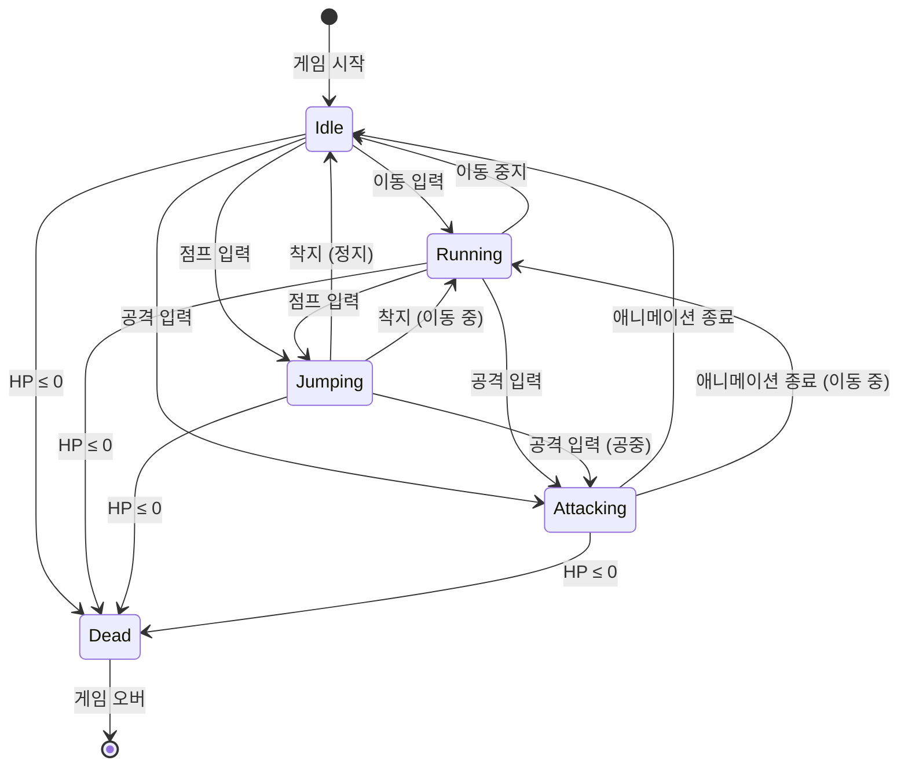

# Player State Machine

**생성일**: 2026-03-27
**상태 수**: 5
**도구**: Mermaid stateDiagram-v2

## 상태 머신 다이어그램

## 상태 정의

| 상태 | 설명 | 진입 조건 |
|------|------|----------|
| **Idle** | 기본 대기 상태 | 초기 / 이동 중지 / 애니메이션 종료 |
| **Running** | 이동 중 | 이동 입력 / 착지(이동 중) |
| **Jumping** | 공중 상태 | 점프 입력 |
| **Attacking** | 공격 모션 중 | 공격 입력 (지상/공중) |
| **Dead** | 사망 (종단 상태) | HP ≤ 0 (모든 상태에서 진입) |

## 전이 표

| From \ To | Idle | Running | Jumping | Attacking | Dead |
|-----------|:----:|:-------:|:-------:|:---------:|:----:|
| **Idle** | — | 이동 입력 | 점프 입력 | 공격 입력 | HP ≤ 0 |
| **Running** | 이동 중지 | — | 점프 입력 | 공격 입력 | HP ≤ 0 |
| **Jumping** | 착지(정지) | 착지(이동) | — | 공격 입력 | HP ≤ 0 |
| **Attacking** | 애니 종료 | 애니 종료(이동) | — | — | HP ≤ 0 |
| **Dead** | — | — | — | — | — |

## 구현 노트

- **글로벌 전이** (`Any → Dead`): 모든 상태에서 HP ≤ 0 체크 — `OnDamaged()` 콜백에서 통합 처리 권장
- **공중 공격 제한**: Jumping → Attacking은 1회 제한으로 무한 체공 방지
- **착지 분기**: 지면 충돌 시 이동 입력 여부에 따라 Idle / Running 자동 분기
- **Attacking 우선순위**: 공격 중 이동/점프 입력 차단 (취소 허용 시 Attacking → Running 전이 추가)
