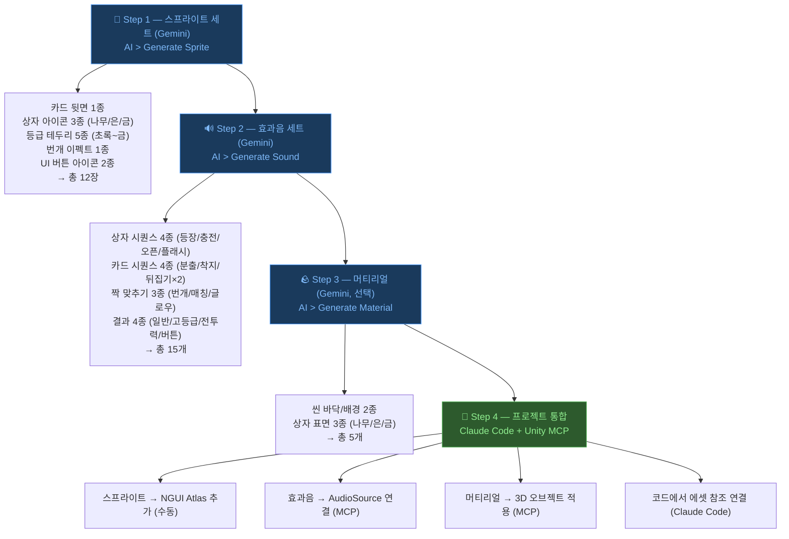
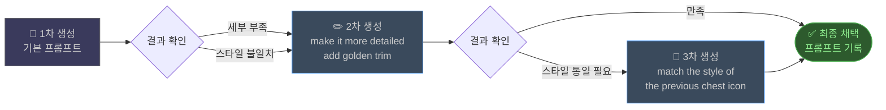

# Unity AI 에셋 생성 가이드 (Gemini)

> **작성일**: 2026-03-15
> **기반**: [Unity 공식 학습 과정](https://learn.unity.com/course/prototype-a-scene-with-unity-ai)
> **적용 프로젝트**: GodBlade, Low 바둑이, 향후 모든 Unity 프로젝트

---

## 1. 비용 최적화 도구 분담

| 작업 | 도구 | 비용 | 비고 |
|------|------|:----:|------|
| 코드 작성/분석 | Claude Code CLI + Unity MCP | 기존 과금 | 메인 도구 |
| 씬 구조/GameObject | Claude Code CLI + Unity MCP | 기존 과금 | Assistant `/run` 대체 |
| 스크립트 생성/수정 | Claude Code CLI + Unity MCP | 기존 과금 | Assistant `/code` 대체 |
| **스프라이트 생성** | **Unity AI Gemini** | Google API | **Gemini 전용** |
| **사운드 생성** | **Unity AI Gemini** | Google API | **Gemini 전용** |
| **머티리얼/텍스처** | **Unity AI Gemini** | Google API | **Gemini 전용** |
| **애니메이션 생성** | **Unity AI Gemini** | Google API | **Gemini 전용** |
| Unity AI Claude | 안 씀 | 추가 과금 | MCP로 대체 |

> **원칙**: Claude 비용은 CLI 하나로 통합. Unity AI는 **Gemini로 에셋 생성만** 사용.

---

## 2. Unity AI Gemini 설정

### 2.1 활성화

1. **Edit > Preferences > AI > Gateway**
2. Agent Type: **Gemini** 선택
3. API Key 입력 (NanoBanana MCP와 같은 Google API Key)

### 2.2 Assistant 창 배치

- **Window > AI > Assistant** 열기
- Inspector 옆에 **세로로 도킹**
- 하단 드롭다운에서 **Gemini** 선택 확인

---

## 3. Unity AI 사용 모드 구분

Unity AI는 **두 가지 독립적인 사용 모드**가 있다. 목적에 따라 구분하여 사용한다.

| 모드 | 진입 경로 | 방식 | 대상 오브젝트 |
|------|----------|------|:------------:|
| **Generator** | `AI > Generate Sprite/Sound/Material/Animation` | 텍스트 프롬프트 → 에셋 신규 생성 | 불필요 |
| **Assistant** | `Window > AI > Assistant` | 대화형 명령 → 씬/스크립트 수정 | 필요 시 명시 |

### Generator 모드 (이 가이드 주 내용)

- **무엇을 그릴 것인가**를 영어로 묘사하면 에셋을 생성해줌
- 씬의 오브젝트를 선택하지 않아도 됨
- 프롬프트의 `[대상]`은 **게임오브젝트가 아니라 이미지/사운드의 묘사**
  - 예: `wooden treasure chest`, `lightning bolt effect`

### Assistant 모드 (씬 조작용)

- 씬의 오브젝트를 직접 수정하거나 스크립트를 생성할 때 사용
- 특정 오브젝트에 작업할 때는 Hierarchy에서 선택하거나 프롬프트에 명시
  - 예: `"Add a PointLight to the GachaBox object with intensity 2.0"`
- Claude Code CLI + Unity MCP로 대체 가능 (이 워크스페이스 기본 도구)

> **이 가이드의 프롬프트 예시들은 모두 Generator 모드용이다.**

---

## 4. Sprite Generator — 2D 이미지/아이콘 생성

### 사용법

Unity Editor에서 **AI > Generate Sprite** 또는 Assistant 창에서 요청.

### 프롬프트 작성법

**좋은 프롬프트 공식:**
```
[대상] [스타일] [색상/분위기] [배경 지시]
```

### 가챠 시스템 프롬프트 예시

**카드 뒷면:**
```
fantasy playing card back design, ornate golden border, dark blue center
with magical rune pattern, high detail, transparent background
```

**상자 아이콘 3종:**
```
// 100원 — 나무 상자
wooden treasure chest, simple design, bronze lock, fantasy game icon style,
transparent background

// 1000원 — 은 상자
silver treasure chest with blue gems, elegant engravings, magical glow,
fantasy game icon style, transparent background

// 10000원 — 금 상자
golden treasure chest with ruby gems, ornate dragon engravings,
epic magical aura, fantasy game icon style, transparent background
```

**등급별 테두리:**
```
// 7성 (초록)
glowing green card border frame, magical energy, RPG style, transparent background

// 8성 (파랑)
glowing blue card border frame, frost energy, RPG style, transparent background

// 9성 (보라)
glowing purple card border frame, dark magic energy, RPG style, transparent background

// 10성 (빨강)
glowing red card border frame, fire energy, RPG style, transparent background

// 11성 (금)
glowing golden card border frame, divine holy energy, RPG style, transparent background
```

**번개 이펙트:**
```
lightning bolt effect sprite, bright electric blue, stylized,
game VFX style, transparent background
```

**UI 버튼 아이콘:**
```
// 뽑기 버튼
gacha slot machine icon, golden, sparkle effect, game UI style, transparent background

// 도전 버튼
crossed swords challenge icon, silver and red, game UI style, transparent background
```

### 생성 후 프로젝트 적용

```
1. Sprite Generator로 생성
2. Assets/ResourcesBundle/GameData/UI/Gacha/ 폴더에 저장
3. NGUI Atlas에 추가 (NGUI > Atlas Maker > Add)
4. UISprite.spriteName으로 코드에서 참조
```

### 프롬프트 팁

| 팁 | 설명 |
|-----|------|
| **"transparent background"** 필수 | 게임 UI용 스프라이트는 투명 배경 필수 |
| **스타일 일관성** | 같은 세트는 동일 스타일 키워드 반복 (예: "fantasy game icon style") |
| **해상도 지정** | 필요시 "512x512" 또는 "1024x1024" 명시 |
| **레퍼런스 언급** | "similar to Diablo treasure chest" 등 참조 게임 언급 |
| **반복 생성** | 마음에 안 들면 프롬프트 수정 후 재생성 (비용 저렴) |

---

## 5. Sound Generator — 효과음/배경음 생성

### 사용법

Unity Editor에서 **AI > Generate Sound** 또는 Assistant 창에서 요청.

### 가챠 시스템 효과음 전체 세트

**상자 개봉 시퀀스:**
```
// 상자 등장
deep magical whoosh sound, treasure appearing, fantasy game, 1 second

// 상자 진동/충전
building energy charge sound, increasing intensity, magical sparkle, 2 seconds

// 상자 폭발 오픈
epic treasure chest burst open, magical explosion with sparkles,
bright and impactful, 1 second

// 화면 플래시
bright flash impact sound, short and sharp, cinematic, 0.3 seconds
```

**카드 연출:**
```
// 카드 분출 (상자에서 튀어나옴)
cards scattering whoosh, multiple objects flying, fantasy, 1 second

// 카드 착지 (그리드 배치)
soft card place down sound, gentle tap, 0.2 seconds

// 카드 뒤집기
single card flip sound, crisp paper turning, 0.3 seconds

// 카드 뒤집기 (고등급)
card flip with magical chime, epic reveal, sparkling, 0.5 seconds
```

**짝 맞추기 연출:**
```
// 번개 이펙트
electric lightning strike, dramatic zap, powerful, 0.5 seconds

// 짝 매칭 성공
triumphant match sound, two chimes harmonizing, rewarding, 1 second

// 카드 글로우 (지속)
sustained magical humming glow, ambient, looping, 2 seconds
```

**결과 표시:**
```
// 일반 아이템 획득
simple item acquire notification, soft positive chime, 0.5 seconds

// 고등급 아이템 획득
epic item acquisition fanfare, triumphant horns and sparkles, 2 seconds

// 전투력 상승
stat increase ascending chime, positive growth sound, 1 second

// "한번 더" 버튼 등장
subtle UI button appear sound, inviting, 0.3 seconds
```

**바둑이 (Low Baduki) 효과음 예시:**
```
// 카드 딜링
card dealing flick sound, casino style, quick, 0.2 seconds

// 카드 오픈
card reveal flip, clean, casino poker style, 0.3 seconds

// 베팅 칩
poker chip stack sound, casino chip clicking, 0.3 seconds

// 승리
poker winning celebration, coins and applause, 2 seconds
```

### 프롬프트 팁

| 팁 | 설명 |
|-----|------|
| **길이 명시** | "1 second", "0.3 seconds" 등 정확한 길이 지정 |
| **루핑 여부** | 반복 재생이면 "looping" 명시 |
| **분위기 키워드** | "fantasy", "epic", "subtle", "cinematic" |
| **참조 게임** | "similar to Hearthstone card flip" 등 |
| **연출 순서대로 생성** | 타임라인 순서로 한 세트씩 만들면 톤 일관성 유지 |

### 생성 후 프로젝트 적용

```
1. Sound Generator로 생성
2. Assets/ResourcesBundle/Sound/Gacha/ 폴더에 저장
3. AudioSource 또는 SoundManager에서 재생
4. 볼륨/피치 미세 조정은 Unity Inspector에서
```

---

## 6. Material & Texture Generator — 3D 표면 생성

### 가챠 시스템 머티리얼

```
// 뽑기 씬 바닥
dark polished stone floor, subtle magical runes glowing blue,
dungeon atmosphere, seamless tileable

// 뽑기 씬 배경
dark fantasy void background, deep purple and blue nebula,
subtle particle stars, atmospheric

// 나무 상자 표면
aged wooden planks with iron bands, fantasy treasure chest texture,
warm brown tones, detailed grain

// 은 상자 표면
polished silver metal with blue gem inlays, ornate fantasy engravings,
cool metallic shine

// 금 상자 표면
gleaming gold metal with ruby inlays, intricate dragon engravings,
warm golden glow, luxurious
```

### PBR 맵 지원

Material Generator는 PBR 맵(Albedo, Normal, Metallic, Roughness)을 자동 생성한다.
Built-in RP (Forward)에서도 Standard Shader로 사용 가능.

---

## 7. Animation Generator — 캐릭터 모션 생성

### 사용법

**Humanoid 리그 캐릭터 전용**. 자연어로 모션을 설명하면 AnimationClip 생성.

### 가챠 시스템 애니메이션

```
// 뽑기 씬 캐릭터 대기
character standing idle, breathing gently, slight weight shift,
relaxed pose, looping

// 당첨 시 환호
character celebrating victory, both fists raised, jumping slightly,
excited, 2 seconds

// 꽝 시 실망
character disappointed reaction, shoulders dropping, head tilting down,
subtle, 1.5 seconds
```

### 제한사항

- Humanoid 리그 전용 (GodBlade 캐릭터는 Humanoid)
- 복잡한 전투 모션은 품질 한계
- **프로토타입용** — 최종 품질은 기존 애니메이션 에셋 또는 수동 제작

---

## 8. 에셋 생성 워크플로우 (가챠 전체)



---

## 9. 프롬프트 품질 향상 기법

### 반복 개선 패턴



### 스타일 일관성 키워드 세트

프로젝트별로 **스타일 키워드 세트**를 정해두면 에셋 간 일관성이 유지된다.

**GodBlade 스타일:**
```
dark fantasy, medieval RPG, ornate details, magical glow,
rich colors (gold/blue/purple), game icon style
```

**Low 바둑이 스타일:**
```
casino elegant, modern card game, clean design,
green felt texture, gold accents, poker style
```

### 배치 생성 팁

- 같은 카테고리 에셋은 **한 세션에서 연속 생성** (스타일 일관성)
- 프롬프트에 **이전 결과 참조** 가능 ("same style as the previous one")
- 만족스러운 결과물은 **프롬프트를 기록** (재현 가능하도록)

---

## 10. 생성 에셋 저장 경로 규칙

| 에셋 유형 | 저장 경로 | 비고 |
|----------|----------|------|
| 스프라이트 | `Assets/ResourcesBundle/GameData/UI/Gacha/` | NGUI Atlas 추가 필요 |
| 효과음 | `Assets/ResourcesBundle/Sound/Gacha/` | AudioClip |
| 머티리얼 | `Assets/ResourcesBundle/GameData/Material/Gacha/` | Standard Shader |
| 텍스처 | `Assets/ResourcesBundle/GameData/Texture/Gacha/` | PBR 맵 포함 |
| 애니메이션 | `Assets/ResourcesBundle/GameData/Animation/Gacha/` | AnimationClip |

> 경로는 GodBlade 기존 에셋 구조(`ResourcesBundle/GameData/`)를 따른다.
> 신규 프로젝트(바둑이 등)는 해당 프로젝트의 에셋 구조를 따른다.

---

*참조: [Unity AI 공식 학습 과정](https://learn.unity.com/course/prototype-a-scene-with-unity-ai)*
*Last Updated: 2026-03-15*
