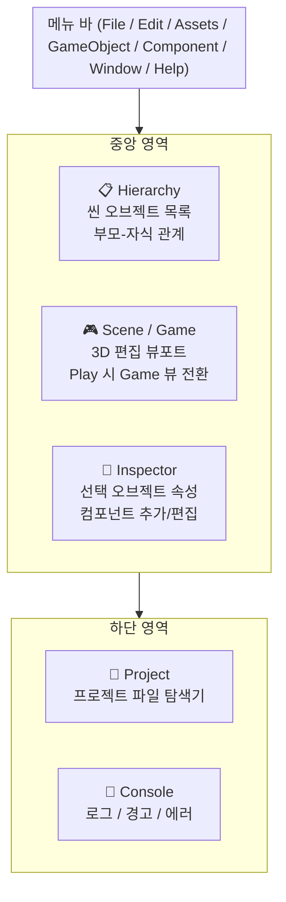
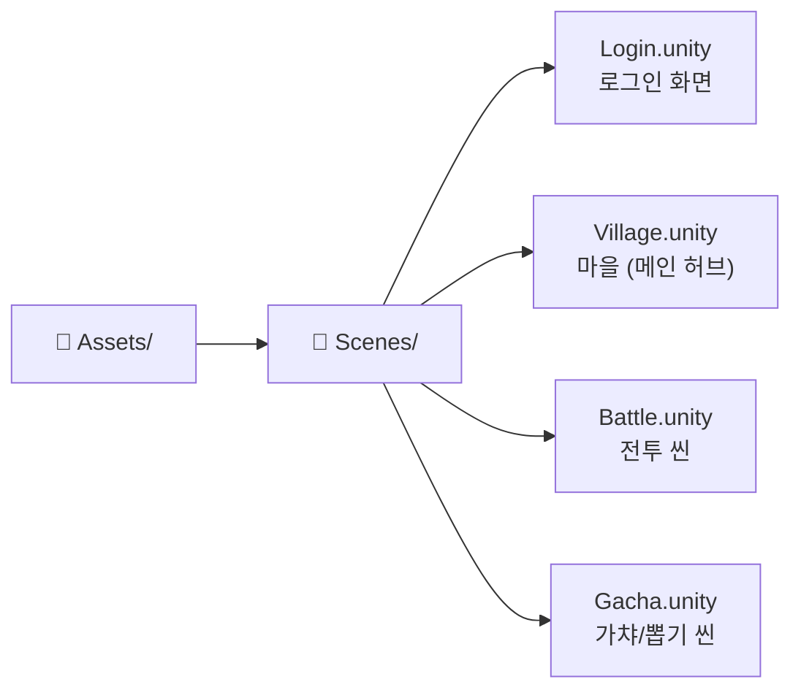
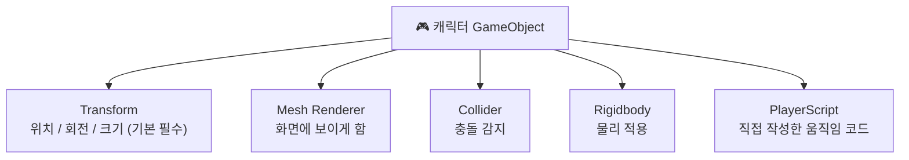
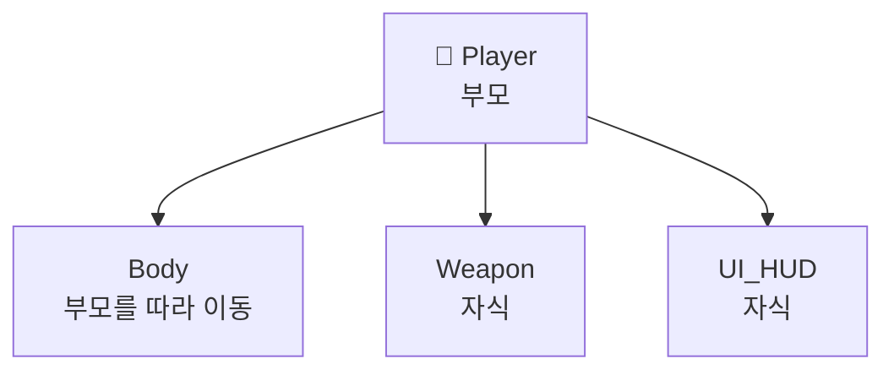
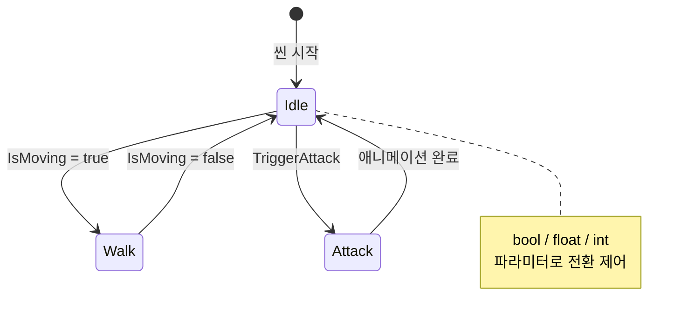
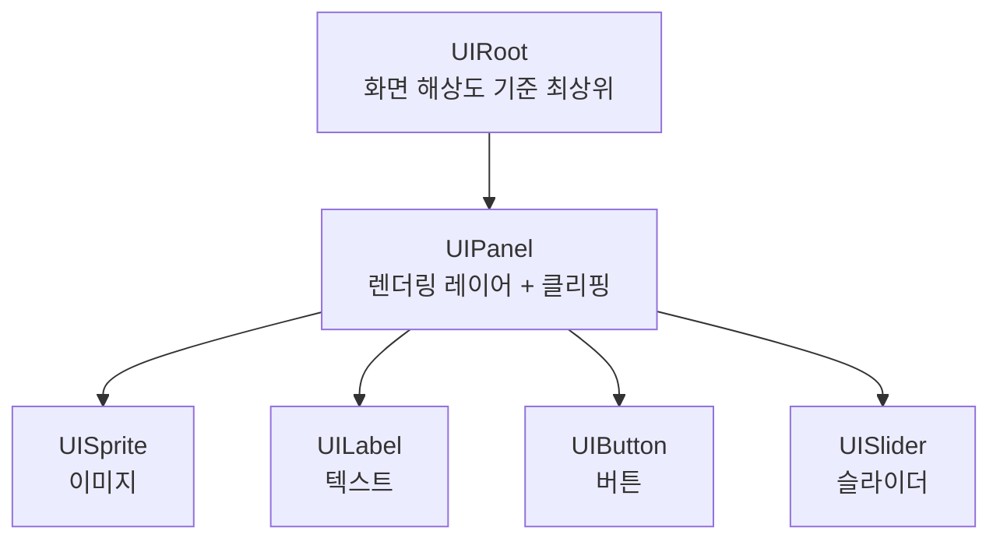
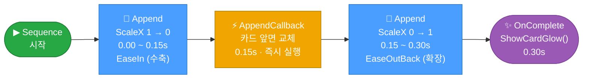
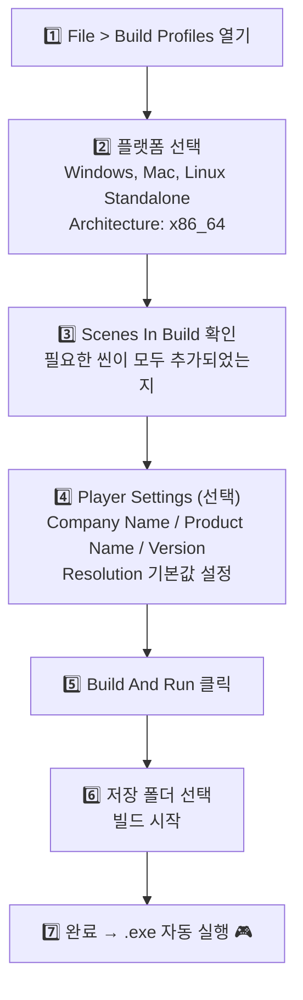

# Unity 6 기초 가이드 (완전 초보자용)

> **작성일**: 2026-03-15
> **Unity 버전**: 6000.3.10f1 LTS (Unity 6)
> **대상**: Unity를 처음 접하는 완전 초보자
> **적용 프로젝트**: GodBlade (Built-in RP, NGUI, DOTween)

---

## 목차

1. [Unity 에디터 인터페이스](#1-unity-에디터-인터페이스)
2. [씬(Scene) 관리](#2-씬scene-관리)
3. [게임오브젝트 & 컴포넌트](#3-게임오브젝트--컴포넌트)
4. [물리(Physics)](#4-물리physics)
5. [조명(Lighting)](#5-조명lighting)
6. [애니메이션(Animation)](#6-애니메이션animation)
7. [오디오(Audio)](#7-오디오audio)
8. [스크립팅 기초 (C#)](#8-스크립팅-기초-c)
9. [UI 시스템 — NGUI + UITweener (GodBlade)](#9-ui-시스템--ngui--uitweener-godblade)
10. [DOTween — 애니메이션 라이브러리](#10-dotween--애니메이션-라이브러리)
11. [빌드 & 게임 실행](#11-빌드--게임-실행)
12. [GodBlade 프로젝트 실무 팁](#12-godblade-프로젝트-실무-팁)

---

## 1. Unity 에디터 인터페이스

### 1.1 주요 창(Window) 구성

Unity를 열면 5개의 주요 창이 배치됩니다.

> 🖥️ 인터랙티브 레이아웃 탐색: [Unity 에디터 레이아웃 Explorer](../assets/playground/unity-editor-layout.html)



| 창 | 역할 | 핵심 사용법 |
|----|------|-----------|
| **Hierarchy** | 현재 씬의 모든 오브젝트 목록 | 오브젝트 선택, 부모-자식 관계 설정 |
| **Scene** | 3D/2D 편집 뷰포트 | 오브젝트 배치, 이동, 회전 |
| **Game** | 실제 카메라로 본 게임 화면 | Play 버튼 눌러 실행 결과 확인 |
| **Inspector** | 선택한 오브젝트의 속성 | 컴포넌트 추가/편집, 변수 값 수정 |
| **Project** | 프로젝트 파일 탐색기 | 에셋(씬, 스크립트, 이미지 등) 관리 |
| **Console** | 로그/에러 출력 창 | `Debug.Log()` 출력, 에러 확인 |

### 1.2 필수 단축키

| 단축키 | 동작 |
|--------|------|
| **W** | 이동 도구 (Move) |
| **E** | 회전 도구 (Rotate) |
| **R** | 크기 도구 (Scale) |
| **Ctrl+Z** | 실행 취소 |
| **Ctrl+S** | 씬 저장 |
| **Ctrl+D** | 오브젝트 복제 |
| **F** | 선택한 오브젝트로 포커스 |
| **Alt+마우스 드래그** | 씬 뷰 회전 |
| **마우스 휠** | 줌 인/아웃 |
| **▶ (Play)** | 게임 실행/정지 |

> ⚠️ **주의**: Play 모드 중 Inspector에서 변경한 값은 Play 종료 시 **초기화**됩니다. 영구 저장하려면 Play를 종료한 후 수정하세요.

---

## 2. 씬(Scene) 관리

### 2.1 씬이란?

씬(Scene)은 게임의 "방" 하나입니다. 메인 메뉴, 스테이지 1, 보스 방 등 각각을 씬으로 구분합니다.



### 2.2 씬 기본 조작

**새 씬 만들기**: `File > New Scene` 또는 `Ctrl+N`

**씬 저장**: `Ctrl+S` (반드시 `.unity` 파일로 저장)

**씬 열기**: Project 창에서 `.unity` 파일 더블클릭

**씬 전환 (코드)**:
```csharp
using UnityEngine.SceneManagement;

// 씬 이름으로 전환
SceneManager.LoadScene("Village");

// 씬 인덱스로 전환 (Build Settings 순서)
SceneManager.LoadScene(0);

// 비동기 전환 (로딩 화면 있을 때)
SceneManager.LoadSceneAsync("Battle");
```

### 2.3 씬에 오브젝트 추가

- **메뉴**: `GameObject > 3D Object / 2D Object / Light / ...`
- **우클릭 단축**: Hierarchy 창에서 우클릭 → 원하는 오브젝트 선택
- **드래그**: Project 창의 Prefab을 Hierarchy 또는 Scene으로 드래그

---

## 3. 게임오브젝트 & 컴포넌트

### 3.1 게임오브젝트(GameObject)

Unity의 모든 것은 **GameObject**입니다. 캐릭터, 카메라, 조명, 빈 그룹 오브젝트 모두 GameObject입니다.

모든 GameObject는 기본적으로 **Transform 컴포넌트**를 가집니다:
- **Position** (위치): x, y, z 좌표
- **Rotation** (회전): x, y, z 각도
- **Scale** (크기): x, y, z 배율

### 3.2 컴포넌트(Component)

컴포넌트는 GameObject에 부착하는 **기능 블록**입니다.



**컴포넌트 추가 방법**:
1. Hierarchy에서 GameObject 선택
2. Inspector 하단 `Add Component` 클릭
3. 검색창에 컴포넌트명 입력

### 3.3 부모-자식 관계 (Parent-Child)

Hierarchy에서 오브젝트를 다른 오브젝트 위로 드래그하면 **자식(Child)**이 됩니다.



자식은 부모의 이동/회전에 **자동으로 따라옵니다**. NGUI의 UIPanel 아래 모든 UI 요소를 두는 방식이 이 원리입니다.

### 3.4 Prefab (프리팹)

프리팹은 **재사용 가능한 GameObject 템플릿**입니다.

**프리팹 만들기**:
1. Hierarchy에서 오브젝트 완성
2. Project 창으로 **드래그** → 파란색 아이콘으로 변환됨

**프리팹 수정 (모든 인스턴스에 반영)**:
- Project에서 프리팹 더블클릭 → Prefab Mode 진입 → 수정 → 저장

**코드에서 프리팹 생성**:
```csharp
public GameObject cardPrefab;  // Inspector에서 연결

// 위치 (0,0,0)에 카드 생성
GameObject card = Instantiate(cardPrefab, Vector3.zero, Quaternion.identity);

// 생성된 오브젝트 삭제
Destroy(card, 2f);  // 2초 후 삭제
```

---

## 4. 물리(Physics)

### 4.1 Rigidbody — 물리 적용

물리 엔진의 영향을 받으려면 **Rigidbody** 컴포넌트가 필요합니다.

`Add Component > Physics > Rigidbody`

| 속성 | 설명 |
|------|------|
| **Mass** | 질량 (클수록 힘에 덜 반응) |
| **Drag** | 공기 저항 |
| **Angular Drag** | 회전 저항 |
| **Use Gravity** | 중력 적용 여부 |
| **Is Kinematic** | 체크 시 물리 무시, 코드로만 이동 가능 |

> GodBlade처럼 2D 캐릭터 이동을 직접 제어하는 경우, `Is Kinematic = true`로 설정하고 `Transform.position`을 직접 변경하는 방식을 많이 사용합니다.

### 4.2 Collider — 충돌 감지

Collider는 오브젝트의 **충돌 영역**을 정의합니다.

| Collider 종류 | 사용 예시 |
|--------------|---------|
| Box Collider | 박스형 오브젝트, UI 버튼 히트박스 |
| Sphere Collider | 공, 캐릭터 머리 |
| Capsule Collider | 캐릭터 몸통 (일반적) |
| Mesh Collider | 복잡한 3D 형태 (성능 주의) |

**충돌 이벤트 코드**:
```csharp
// 충돌 시작
void OnCollisionEnter(Collision collision) {
    Debug.Log("충돌: " + collision.gameObject.name);
}

// 트리거(Is Trigger 체크) 진입
void OnTriggerEnter(Collider other) {
    Debug.Log("트리거 진입: " + other.name);
}
```

---

## 5. 조명(Lighting)

### 5.1 조명 종류

| 조명 | 특징 | 사용 예 |
|------|------|--------|
| **Directional Light** | 무한히 먼 태양광, 방향만 있음 | 야외 씬, 전체 조명 |
| **Point Light** | 전구처럼 사방으로 빛 발산 | 횃불, 마법 이펙트 |
| **Spot Light** | 원뿔 형태, 손전등처럼 | 무대 조명, 강조 효과 |
| **Area Light** | 직사각형 면에서 발산 | 창문 빛, 형광등 |

씬을 처음 열면 기본으로 **Directional Light 1개 + Camera 1개**가 있습니다.

### 5.2 조명 설정 (Inspector)

- **Color**: 빛의 색상 (따뜻한 노란색, 차가운 파란색 등)
- **Intensity**: 밝기
- **Range**: Point/Spot Light의 빛이 닿는 거리
- **Shadow Type**: 그림자 종류 (No Shadows / Hard Shadows / Soft Shadows)

> GodBlade는 **Built-in Render Pipeline**을 사용하므로 URP/HDRP 관련 설정은 적용되지 않습니다.

---

## 6. 애니메이션(Animation)

### 6.1 Animation 시스템 구조



### 6.2 Animator 컴포넌트

캐릭터 GameObject에 `Animator` 컴포넌트를 추가하고, **Animator Controller**를 연결합니다.

**코드에서 애니메이션 제어**:
```csharp
Animator animator;

void Start() {
    animator = GetComponent<Animator>();
}

// bool 파라미터로 상태 전환
void Update() {
    bool isMoving = Input.GetAxis("Horizontal") != 0;
    animator.SetBool("IsMoving", isMoving);
}

// 즉시 상태 변경
animator.Play("AttackAnimation");
```

### 6.3 Animation 클립 직접 편집

`Window > Animation > Animation` 창을 열면 타임라인에서 키프레임을 직접 편집할 수 있습니다.

**기본 흐름**:
1. Hierarchy에서 애니메이션할 오브젝트 선택
2. Animation 창에서 `Create` 클릭 → `.anim` 파일 저장
3. `Record` 버튼(빨간 원) 클릭 후 변경하면 자동으로 키프레임 생성
4. Record 종료 후 `▶` 버튼으로 미리보기

---

## 7. 오디오(Audio)

### 7.1 오디오 컴포넌트

| 컴포넌트 | 역할 |
|---------|------|
| **Audio Source** | 소리를 재생하는 "스피커" |
| **Audio Listener** | 소리를 듣는 "귀" (보통 카메라에 부착) |
| **Audio Mixer** | 여러 소리의 볼륨/이펙트 믹싱 |

### 7.2 AudioSource 주요 속성

| 속성 | 설명 |
|------|------|
| **AudioClip** | 재생할 사운드 파일 |
| **Play On Awake** | 씬 시작 시 자동 재생 (BGM에 사용) |
| **Loop** | 반복 재생 |
| **Volume** | 볼륨 (0.0 ~ 1.0) |
| **Spatial Blend** | 0 = 2D (거리 무관), 1 = 3D (거리에 따라 음량 변화) |

### 7.3 코드에서 사운드 재생

```csharp
AudioSource audioSource;
public AudioClip cardFlipSound;
public AudioClip bgmClip;

void Start() {
    audioSource = GetComponent<AudioSource>();
}

// 효과음 재생 (원샷)
public void PlayCardFlip() {
    audioSource.PlayOneShot(cardFlipSound);
}

// BGM 재생
public void PlayBGM() {
    audioSource.clip = bgmClip;
    audioSource.loop = true;
    audioSource.Play();
}

// BGM 정지
public void StopBGM() {
    audioSource.Stop();
}
```

---

## 8. 스크립팅 기초 (C#)

### 8.1 MonoBehaviour 기초

모든 Unity 스크립트는 **MonoBehaviour**를 상속합니다.

```csharp
using UnityEngine;

public class MyScript : MonoBehaviour
{
    // 공개 변수 → Inspector에서 수정 가능
    public float speed = 5f;

    // 비공개 변수 (Inspector에서 숨김)
    private int score = 0;

    // [SerializeField] → 비공개지만 Inspector에 표시
    [SerializeField] private int health = 100;

    // 씬 시작 시 1번 호출
    void Start() {
        Debug.Log("게임 시작!");
    }

    // 매 프레임마다 호출 (60fps면 초당 60번)
    void Update() {
        // 이동 예시
        float h = Input.GetAxis("Horizontal");
        transform.Translate(h * speed * Time.deltaTime, 0, 0);
    }

    // 물리 처리용 (고정 프레임 간격)
    void FixedUpdate() {
        // Rigidbody 조작은 여기서
    }
}
```

### 8.2 주요 이벤트 함수

| 함수 | 호출 시점 |
|------|----------|
| `Awake()` | 오브젝트 생성 직후 (Start보다 먼저) |
| `Start()` | 씬 시작 시 1번 |
| `Update()` | 매 프레임 |
| `FixedUpdate()` | 물리 고정 프레임 (0.02초 간격) |
| `LateUpdate()` | Update 후 (카메라 추적 등에 사용) |
| `OnDestroy()` | 오브젝트 파괴 시 |
| `OnEnable/OnDisable()` | 활성화/비활성화 시 |

### 8.3 컴포넌트 참조

```csharp
// 같은 오브젝트의 컴포넌트 가져오기
Animator anim = GetComponent<Animator>();

// 자식 오브젝트에서 컴포넌트 찾기
UILabel label = GetComponentInChildren<UILabel>();

// 이름으로 오브젝트 찾기 (느림, 자주 사용 비추천)
GameObject obj = GameObject.Find("PlayerName");

// 태그로 오브젝트 찾기
GameObject player = GameObject.FindWithTag("Player");
```

### 8.4 코루틴 (Coroutine) — 시간 지연 처리

```csharp
// 코루틴 시작
StartCoroutine(ShowCardAnimation());

// 코루틴 정의
IEnumerator ShowCardAnimation() {
    // 즉시 실행
    card.SetActive(true);

    // 1초 대기
    yield return new WaitForSeconds(1f);

    // 1초 후 실행
    card.GetComponent<Animator>().Play("FlipAnimation");

    // 0.5초 더 대기
    yield return new WaitForSeconds(0.5f);

    // 완료 처리
    ShowResult();
}
```

---

## 9. UI 시스템 — NGUI + UITweener (GodBlade)

> GodBlade는 Unity 내장 UGUI 대신 **NGUI** 플러그인을 사용합니다. 기존 코드를 수정할 때는 NGUI 방식을 따르세요.

### 9.1 NGUI 핵심 구조



### 9.2 주요 NGUI 컴포넌트

| 컴포넌트 | 역할 |
|---------|------|
| **UIRoot** | UI 전체 기준점, 해상도 스케일링 |
| **UIPanel** | 렌더링 순서(Depth), 알파, 클리핑 영역 |
| **UISprite** | Atlas에서 스프라이트 이미지 표시 |
| **UILabel** | 텍스트 표시 (폰트, 크기, 색상) |
| **UIButton** | 버튼 클릭 이벤트 처리 |
| **UITexture** | Atlas 없이 Texture2D 직접 표시 |
| **UIScrollView** | 스크롤 가능한 컨테이너 |

### 9.3 코드에서 NGUI 조작

```csharp
// UILabel 텍스트 변경
UILabel scoreLabel = transform.Find("ScoreLabel").GetComponent<UILabel>();
scoreLabel.text = "점수: " + score;

// UISprite 이미지 변경 (Atlas 내 스프라이트명)
UISprite icon = GetComponent<UISprite>();
icon.spriteName = "icon_gold_chest";

// UIPanel 알파 (전체 UI 투명도)
UIPanel panel = GetComponent<UIPanel>();
panel.alpha = 0.5f;  // 반투명

// 오브젝트 활성/비활성 (NGUI 방식)
NGUITools.SetActive(gameObject, true);
NGUITools.SetActive(gameObject, false);
```

### 9.4 UITweener — 기존 UI 애니메이션

UITweener는 NGUI에 내장된 트위닝 시스템입니다. **기존 GodBlade 코드**에서 사용 중이므로 수정 시 참고하세요.

```csharp
// 위치 트위닝
TweenPosition tp = TweenPosition.Begin(gameObject, 0.5f, new Vector3(100, 0, 0));
tp.method = UITweener.Method.EaseOut;

// 알파 트위닝 (페이드 인/아웃)
TweenAlpha ta = TweenAlpha.Begin(gameObject, 0.3f, 1.0f);  // 0.3초에 알파 1.0으로

// 크기 트위닝
TweenScale ts = TweenScale.Begin(gameObject, 0.2f, Vector3.one * 1.2f);

// 완료 이벤트 연결
ta.onFinished.Add(new EventDelegate(OnFadeComplete));
void OnFadeComplete() { /* 완료 처리 */ }
```

---

## 10. DOTween — 애니메이션 라이브러리

> GodBlade에 **신규 도입**된 라이브러리입니다. 새로 작성하는 가챠 연출 등 **신규 코드에 사용**하고, 기존 UITweener 코드는 수정하지 않습니다.

### 10.1 DOTween 기초

```csharp
using DG.Tweening;

// 이동: 1초 동안 (100, 0, 0)으로 이동
transform.DOMove(new Vector3(100, 0, 0), 1f);

// 로컬 이동
transform.DOLocalMove(new Vector3(0, 50, 0), 0.5f);

// 크기 변경: 0.2초에 1.2배로
transform.DOScale(Vector3.one * 1.2f, 0.2f);

// 알파 페이드 (CanvasGroup 또는 UIPanel)
GetComponent<CanvasGroup>().DOFade(0f, 0.5f);  // 0.5초에 투명으로

// Ease 설정 (가속/감속 곡선)
transform.DOMove(new Vector3(0, 100, 0), 1f).SetEase(Ease.OutBounce);
```

### 10.2 DOTween Sequence — 순서대로 실행

```csharp
// 가챠 카드 뒤집기 시퀀스 예시
Sequence gachaSeq = DOTween.Sequence();

// 0.3초에 카드가 x 크기 0으로 수축
gachaSeq.Append(cardTransform.DOScaleX(0f, 0.15f));

// 즉시 앞면으로 교체
gachaSeq.AppendCallback(() => {
    cardFront.SetActive(true);
    cardBack.SetActive(false);
});

// 다시 x 크기 1로 확장
gachaSeq.Append(cardTransform.DOScaleX(1f, 0.15f).SetEase(Ease.OutBack));

// 완료 콜백
gachaSeq.OnComplete(() => {
    ShowCardGlow();
});
```



### 10.3 DOTween 주요 Ease 종류

| Ease | 특징 | 사용 예 |
|------|------|--------|
| `Linear` | 일정 속도 | 단조로운 이동 |
| `EaseInOut` | 시작/끝 느리고 중간 빠름 | 부드러운 이동 |
| `EaseOutBack` | 목표를 살짝 지나쳤다 돌아옴 | 팝업 등장, 버튼 클릭 |
| `EaseOutBounce` | 목표에서 통통 튀는 효과 | 아이콘 등장 |
| `EaseOutElastic` | 탄성 있게 흔들림 | 강조 연출 |

### 10.4 주요 패턴

```csharp
// 지연 실행
DOVirtual.DelayedCall(1f, () => {
    Debug.Log("1초 후 실행");
});

// 반복 (무한 루프)
transform.DORotate(new Vector3(0, 360, 0), 3f, RotateMode.FastBeyond360)
    .SetLoops(-1, LoopType.Restart);

// 중간에 정지
Tweener tween = transform.DOMove(target, 2f);
tween.Pause();
tween.Play();
tween.Kill();  // 완전 제거
```

---

## 11. 빌드 & 게임 실행

### 11.1 에디터에서 즉시 실행 (Play Mode)

개발 중 가장 많이 사용하는 방법입니다.

1. 씬이 저장된 상태에서 **▶ (Play) 버튼** 클릭
2. Game 창에서 게임 화면 확인
3. **▶ 버튼 다시 클릭** (또는 `Ctrl+P`) 으로 정지
4. **⏸ (Pause) 버튼**: 프레임 단위 디버깅

> ⚠️ Play 모드 중 수정한 값은 종료 시 초기화됩니다!

### 11.2 Build Profiles 설정 (Unity 6)

Unity 6에서는 **Build Settings** 대신 **Build Profiles** 창을 사용합니다.

`File > Build Profiles` 열기

**빌드 프로파일 구성**:
1. **Platform 선택**: `Windows, Mac, Linux Standalone` 선택 (PC 빌드)
2. **Scenes In Build** 섹션에서 포함할 씬 추가
   - Hierarchy 창에서 씬을 끌어다 놓거나 `Add Open Scenes` 클릭
   - 순서가 **씬 인덱스 번호**가 됨 (0번 씬이 처음 로드됨)
3. **Build** 또는 **Build And Run** 클릭

### 11.3 Windows PC 빌드 단계



### 11.4 Console 창 — 에러 확인

빌드나 Play 도중 문제가 생기면 **Console 창** 확인이 필수입니다.

`Window > General > Console` 또는 하단 Console 탭

| 아이콘 | 의미 |
|--------|------|
| 🔵 파란 i | Log (일반 정보) |
| 🟡 노란 ! | Warning (경고, 실행은 됨) |
| 🔴 빨간 ✕ | Error (오류, 실행 멈춤) |

에러 클릭 → 하단에 상세 내용 + **클릭하면 해당 스크립트 라인으로 이동**합니다.

---

## 12. GodBlade 프로젝트 실무 팁

### 12.1 프로젝트 열기

1. Unity Hub 실행
2. `Add > Add project from disk` → `god_Sword` 폴더 선택
3. Unity 버전: **6000.3.10f1** 확인 후 Open
4. 처음 열 때 패키지 임포트로 시간이 걸릴 수 있음

### 12.2 씬 구조 탐색

```bash
# 주요 씬 위치
Assets/Scenes/          ← 씬 파일들
Assets/Resources/       ← 동적 로드 에셋
Assets/ResourcesBundle/ ← GodBlade 게임 에셋 주 보관소
  ├── GameData/         ← 캐릭터, UI, 텍스처, 애니메이션
  ├── Sound/            ← BGM, 효과음
  └── Script/           ← 게임 로직 스크립트
```

### 12.3 Unity MCP로 코드 분석

Claude Code + Unity MCP를 사용하면 Editor에서 직접 분석/수정이 가능합니다:

```
Claude에게 요청 예시:
- "현재 씬의 오브젝트 구조 보여줘"
- "GachaManager 스크립트 내용 분석해줘"
- "Gacha 씬에 DOTween을 사용한 카드 뒤집기 오브젝트 만들어줘"
```

### 12.4 DOTween 패키지 확인

Window > Package Manager → My Assets 탭에서 DOTween 설치 확인

**DOTween 초기화** (프로젝트당 1번):
`Tools > Demigiant > DOTween Utility Panel > Setup DOTween...`

### 12.5 자주 하는 실수

| 실수 | 해결 |
|------|------|
| Play 모드에서 수정했는데 사라짐 | Play 종료 후 수정, 또는 종료 전 값 메모 |
| 스크립트 수정 후 반응 없음 | 파일 저장 (`Ctrl+S`) 후 Unity로 돌아와 컴파일 대기 |
| 프리팹 수정했는데 씬에 반영 안 됨 | Prefab Mode에서 저장 또는 `Apply All` |
| Console에 빨간 에러가 가득 | 가장 위 에러부터 해결 (아래 에러는 연쇄 반응일 수 있음) |
| NullReferenceException | Inspector에서 변수 연결이 빠져있을 가능성 높음 |

### 12.6 에셋 저장 경로 규칙

가챠 시스템 신규 에셋은 아래 경로에 저장합니다:

| 에셋 유형 | 저장 경로 |
|----------|----------|
| 스프라이트 (UI) | `Assets/ResourcesBundle/GameData/UI/Gacha/` |
| 효과음 | `Assets/ResourcesBundle/Sound/Gacha/` |
| 머티리얼 | `Assets/ResourcesBundle/GameData/Material/Gacha/` |
| 텍스처 | `Assets/ResourcesBundle/GameData/Texture/Gacha/` |
| 애니메이션 클립 | `Assets/ResourcesBundle/GameData/Animation/Gacha/` |
| 신규 스크립트 | `Assets/ResourcesBundle/Script/Gacha/` |

---

## 참고 링크

- [Unity 6 공식 매뉴얼](https://docs.unity3d.com/6000.0/Documentation/Manual/)
- [Unity Learn — 공식 튜토리얼](https://learn.unity.com/)
- [DOTween 공식 문서](http://dotween.demigiant.com/documentation.php)
- [NGUI 위키 (Tasharen)](https://www.tasharen.com/forum/index.php)
- [Unity AI 에셋 생성 가이드](./2026-03-15-unity-ai-guide.md)

---

*참조: Unity 6 공식 학습 과정 + 공식 매뉴얼*
*Last Updated: 2026-03-15*
