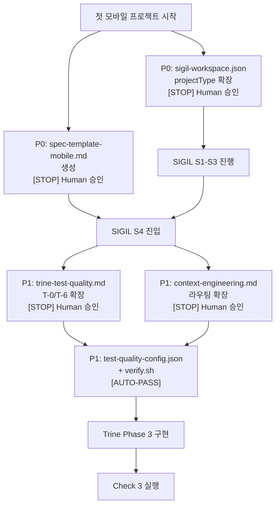

# 모바일 앱 E2E 테스트 전략 가이드

> React Native(1순위) / Flutter(2순위) 서비스 앱의 테스트 전략.
> SIGIL/Trine 파이프라인과 연동하여 품질을 보장한다.

**참조 전용 문서 — Deep 로드 대상 아님:**
- 이 문서는 세션 시작 시 자동 로드하지 않는다. 모바일 프로젝트 작업 시에만 참조.
- `projectType`이 `mobile-rn` 또는 `mobile-flutter`일 때 Phase 2/3에서 필요 섹션만 참조.
- Check 3.5T T-6 검증 시 섹션 5.3만 선택 참조.
- trine-context-engineering.md 라우팅에는 등록하지 않는다 (참조 전용).

---

## 1. 테스트 피라미드

```
           E2E (Detox / integration_test)          — 핵심 플로우 5-10개
          ───────────────────────────────
        Integration (API + 상태관리 연동)           — 모듈 간 연동 검증
       ───────────────────────────────────
      Unit (Jest / flutter_test)                    — 비즈니스 로직 80%+
```

| 레벨 | 비율 | 목적 | 실행 속도 |
|------|:----:|------|:--------:|
| **Unit** | 70% | 비즈니스 로직, 유틸, 상태관리 | 빠름 (ms) |
| **Integration** | 20% | API 연동, 모듈 간 데이터 흐름 | 보통 (s) |
| **E2E** | 10% | 사용자 관점 핵심 시나리오 검증 | 느림 (min) |

---

## 2. React Native 테스트 스택

### 2.1 도구 매핑

| 레벨 | 도구 | 용도 |
|------|------|------|
| Unit | **Jest** + **React Native Testing Library** | 비즈니스 로직, 커스텀 훅, 유틸 함수 |
| Component | **React Native Testing Library** | UI 컴포넌트 렌더링, 인터랙션 검증 |
| Integration | **Jest** + **MSW** (Mock Service Worker) | API 모킹 + 상태관리 연동 검증 |
| E2E | **Detox** | 전체 앱 플로우 (로그인, 결제, 핵심 시나리오) |

### 2.2 Detox 선택 이유

| 항목 | Detox | Appium | Maestro |
|------|:-----:|:------:|:-------:|
| RN 전용 설계 | O | X (범용) | X (범용) |
| 브릿지 동기화 내장 | O (Gray-box) | X (Black-box) | X |
| Jest 문법 호환 | O | X | X |
| 테스트 안정성 (Flaky) | 높음 | 낮음 | 보통 |
| CI 설정 난이도 | 보통 | 높음 | 낮음 |
| 커뮤니티/유지보수 | Wix 공식 | OpenJS Foundation | 스타트업 |

> Detox는 RN 브릿지의 비동기 작업 완료를 자동 대기(Gray-box testing)하여 `sleep`/`waitFor` 없이 안정적인 테스트를 작성할 수 있다.

### 2.3 Detox 설정 예시

```js
// .detoxrc.js
/** @type {Detox.DetoxConfig} */
module.exports = {
  testRunner: {
    args: {
      config: 'e2e/jest.config.js',
      _: ['e2e'],
    },
    retries: 2, // Flaky 대응: 실패 시 2회 재시도
  },
  apps: {
    'ios.debug': {
      type: 'ios.app',
      binaryPath: 'ios/build/Build/Products/Debug-iphonesimulator/MyApp.app',
      build: 'xcodebuild -workspace ios/MyApp.xcworkspace -scheme MyApp -configuration Debug -sdk iphonesimulator -derivedDataPath ios/build',
    },
    'android.debug': {
      type: 'android.apk',
      binaryPath: 'android/app/build/outputs/apk/debug/app-debug.apk',
      build: 'cd android && ./gradlew assembleDebug assembleAndroidTest -DtestBuildType=debug',
      reversePorts: [8081],
    },
  },
  devices: {
    simulator: {
      type: 'ios.simulator',
      device: { type: 'iPhone 15' },
    },
    emulator: {
      type: 'android.emulator',
      device: { avdName: 'Pixel_7_API_34' },
    },
  },
  configurations: {
    'ios.sim.debug': {
      device: 'simulator',
      app: 'ios.debug',
    },
    'android.emu.debug': {
      device: 'emulator',
      app: 'android.debug',
    },
  },
  artifacts: {
    rootDir: 'test-results/', // Trine autoFix 호환: artifacts/ 대신 test-results/ 사용
    plugins: {
      screenshot: 'failing',
      video: 'failing',
      log: 'failing',
    },
  },
};
```

### 2.4 Integration 테스트 예시 (Jest + MSW)

```ts
// src/__tests__/integration/auth-api.test.ts
import { setupServer } from 'msw/node';
import { http, HttpResponse } from 'msw';
import { AuthService } from '../../services/auth.service';
import { useAuthStore } from '../../stores/auth.store';

const server = setupServer(
  http.post('/api/auth/login', async ({ request }) => {
    const body = await request.json();
    if (body.email === 'valid@test.com') {
      return HttpResponse.json({ token: 'mock-jwt', user: { id: 1, email: body.email } });
    }
    return HttpResponse.json({ message: 'Invalid credentials' }, { status: 401 });
  }),
);

beforeAll(() => server.listen());
afterEach(() => server.resetHandlers());
afterAll(() => server.close());

describe('AuthService + AuthStore Integration', () => {
  it('should update store on successful login', async () => {
    const authService = new AuthService();
    const result = await authService.login('valid@test.com', 'password');

    expect(result.token).toBe('mock-jwt');
    expect(useAuthStore.getState().isAuthenticated).toBe(true);
  });

  it('should handle 401 error and clear store', async () => {
    const authService = new AuthService();
    await expect(authService.login('wrong@test.com', 'wrong')).rejects.toThrow('Invalid credentials');
    expect(useAuthStore.getState().isAuthenticated).toBe(false);
  });

  it('should handle network timeout', async () => {
    server.use(
      http.post('/api/auth/login', () => {
        return new Promise(() => {}); // never resolves
      }),
    );
    const authService = new AuthService();
    await expect(authService.login('valid@test.com', 'password'))
      .rejects.toThrow(/timeout/i);
  });
});
```

### 2.5 E2E 테스트 시나리오 템플릿 (Detox)

```js
// e2e/auth.test.js
describe('Authentication Flow', () => {
  beforeAll(async () => {
    await device.launchApp({ newInstance: true });
  });

  it('should sign up with email', async () => {
    await element(by.id('signup-btn')).tap();
    await element(by.id('email-input')).typeText('test@example.com');
    await element(by.id('password-input')).typeText('SecurePass123!');
    await element(by.id('submit-btn')).tap();
    await expect(element(by.id('home-screen'))).toBeVisible();
  });

  it('should show error on invalid credentials', async () => {
    await device.launchApp({ newInstance: true });
    await element(by.id('login-btn')).tap();
    await element(by.id('email-input')).typeText('wrong@example.com');
    await element(by.id('password-input')).typeText('wrong');
    await element(by.id('submit-btn')).tap();
    await expect(element(by.id('error-message'))).toBeVisible();
  });

  it('should logout successfully', async () => {
    // login first...
    await element(by.id('profile-tab')).tap();
    await element(by.id('logout-btn')).tap();
    await expect(element(by.id('login-screen'))).toBeVisible();
  });
});
```

### 2.6 프로젝트 구조 (RN)

```
src/
├── __tests__/              ← Unit/Component 테스트
│   ├── hooks/
│   ├── utils/
│   ├── components/
│   └── integration/        ← Integration 테스트 (MSW 사용)
e2e/
├── jest.config.js          ← Detox Jest 설정
├── auth.test.js            ← 인증 플로우
├── main-flow.test.js       ← 메인 화면 플로우
├── error-handling.test.js  ← 에러 시나리오
└── helpers/
    └── test-utils.js       ← 공통 헬퍼 (로그인 등)
```

---

## 3. Flutter 테스트 스택

### 3.1 도구 매핑

| 레벨 | 도구 | 용도 |
|------|------|------|
| Unit | `flutter_test` (내장) | 비즈니스 로직, Provider/Bloc/Riverpod |
| Widget | `flutter_test` (내장) | UI 컴포넌트 렌더링, 인터랙션 검증 |
| Integration | `flutter_test` + `http_mock_adapter` | API 모킹 + 상태관리 연동 검증 |
| E2E | `integration_test` (내장) | 전체 앱 플로우 (실기기/에뮬레이터) |

> Flutter는 외부 도구 없이 내장 패키지만으로 전체 테스트 레벨을 커버한다.

### 3.2 Integration 테스트 예시 (flutter_test + http_mock_adapter)

```dart
// test/integration/auth_api_test.dart
import 'package:dio/dio.dart';
import 'package:flutter_test/flutter_test.dart';
import 'package:http_mock_adapter/http_mock_adapter.dart';
import 'package:my_app/services/auth_service.dart';
import 'package:my_app/stores/auth_store.dart';

void main() {
  late Dio dio;
  late DioAdapter dioAdapter;
  late AuthService authService;
  late AuthStore authStore;

  setUp(() {
    dio = Dio();
    dioAdapter = DioAdapter(dio: dio);
    authStore = AuthStore();
    authService = AuthService(dio: dio, store: authStore);
  });

  group('AuthService + AuthStore Integration', () {
    test('should update store on successful login', () async {
      dioAdapter.onPost(
        '/api/auth/login',
        (server) => server.reply(200, {
          'token': 'mock-jwt',
          'user': {'id': 1, 'email': 'valid@test.com'},
        }),
        data: {'email': 'valid@test.com', 'password': 'password'},
      );

      await authService.login('valid@test.com', 'password');

      expect(authStore.isAuthenticated, true);
      expect(authStore.token, 'mock-jwt');
    });

    test('should handle 401 error and clear store', () async {
      dioAdapter.onPost(
        '/api/auth/login',
        (server) => server.reply(401, {'message': 'Invalid credentials'}),
        data: {'email': 'wrong@test.com', 'password': 'wrong'},
      );

      expect(
        () => authService.login('wrong@test.com', 'wrong'),
        throwsA(isA<DioException>()),
      );
      expect(authStore.isAuthenticated, false);
    });
  });
}
```

### 3.3 Golden Test (스크린샷 기반 UI 회귀)

```yaml
# pubspec.yaml
dev_dependencies:
  flutter_test:
    sdk: flutter
  golden_toolkit: ^0.15.0
```

```dart
// test/golden/login_screen_test.dart
import 'package:golden_toolkit/golden_toolkit.dart';

void main() {
  testGoldens('LoginScreen - default state', (tester) async {
    await loadAppFonts();
    final builder = DeviceBuilder()
      ..overrideDevicesForAllScenarios(devices: [
        Device.phone,
        Device.iphone11,
        Device.tabletLandscape,
      ])
      ..addScenario(
        widget: const LoginScreen(),
        name: 'default',
      );

    await tester.pumpDeviceBuilder(builder);
    await screenMatchesGolden(tester, 'login_screen_default');
  });
}
```

**Golden Test 갱신 정책 (Human-AI 경계):**

| 상황 | 행동 | 게이트 |
|------|------|:------:|
| Spec FR에 직접 매핑되는 화면 UI 변경 | AI가 `--update-goldens` 자율 실행 허용 | AUTO-PASS |
| Spec FR에 매핑되지 않는 화면 변경 | **[STOP]** Human 확인 필수 | **STOP** |
| 예상치 못한 Golden Test 실패 | **[STOP]** Human 확인 필수 — diff 리포트 제시 | **STOP** |
| 갱신 전 보존 | `test/golden/goldens/` → `test/golden/goldens-backup/` 스냅샷 | 필수 |

> `--update-goldens`는 기존 기준 이미지를 전체 교체하는 비가역적 행동이므로, 예상치 못한 실패 시 반드시 Human diff 리뷰를 거친다.

### 3.4 E2E 테스트 시나리오 템플릿 (integration_test)

```dart
// integration_test/auth_test.dart
import 'package:flutter_test/flutter_test.dart';
import 'package:integration_test/integration_test.dart';
import 'package:my_app/main.dart' as app;

void main() {
  IntegrationTestWidgetsFlutterBinding.ensureInitialized();

  group('Authentication Flow', () {
    testWidgets('should sign up with email', (tester) async {
      app.main();
      await tester.pumpAndSettle();

      await tester.tap(find.byKey(const Key('signup-btn')));
      await tester.pumpAndSettle();

      await tester.enterText(find.byKey(const Key('email-input')), 'test@example.com');
      await tester.enterText(find.byKey(const Key('password-input')), 'SecurePass123!');
      await tester.tap(find.byKey(const Key('submit-btn')));
      await tester.pumpAndSettle();

      expect(find.byKey(const Key('home-screen')), findsOneWidget);
    });

    testWidgets('should show error on invalid credentials', (tester) async {
      app.main();
      await tester.pumpAndSettle();

      await tester.tap(find.byKey(const Key('login-btn')));
      await tester.pumpAndSettle();

      await tester.enterText(find.byKey(const Key('email-input')), 'wrong@example.com');
      await tester.enterText(find.byKey(const Key('password-input')), 'wrong');
      await tester.tap(find.byKey(const Key('submit-btn')));
      await tester.pumpAndSettle();

      expect(find.byKey(const Key('error-message')), findsOneWidget);
    });

    testWidgets('should logout successfully', (tester) async {
      app.main();
      await tester.pumpAndSettle();
      // login first...

      await tester.tap(find.byKey(const Key('profile-tab')));
      await tester.pumpAndSettle();
      await tester.tap(find.byKey(const Key('logout-btn')));
      await tester.pumpAndSettle();

      expect(find.byKey(const Key('login-screen')), findsOneWidget);
    });
  });
}
```

### 3.5 프로젝트 구조 (Flutter)

```
test/
├── unit/                      ← Unit 테스트
│   ├── services/
│   ├── models/
│   └── blocs/
├── integration/               ← Integration 테스트 (http_mock_adapter)
│   └── auth_api_test.dart
├── widget/                    ← Widget 테스트
│   └── screens/
├── golden/                    ← Golden Test (스크린샷 회귀)
│   └── goldens/               ← 기준 이미지
integration_test/
├── auth_test.dart             ← 인증 플로우
├── main_flow_test.dart        ← 메인 화면 플로우
├── error_handling_test.dart   ← 에러 시나리오
└── helpers/
    └── test_utils.dart        ← 공통 헬퍼
```

---

## 4. CI/CD 연동 (GitHub Actions)

### 4.1 React Native (Detox) — PR: Unit+Lint만, E2E: develop/main만

```yaml
# .github/workflows/unit-rn.yml — 매 PR 실행
name: Unit & Lint (React Native)
on:
  pull_request:
    branches: [develop, main]
    paths-ignore:
      - 'docs/**'
      - '*.md'
      - '.github/workflows/e2e-*.yml'
jobs:
  unit-lint:
    runs-on: ubuntu-latest
    steps:
      - uses: actions/checkout@v4
      - uses: actions/setup-node@v4
        with: { node-version: 20 }
      - uses: actions/cache@v4
        with:
          path: node_modules
          key: ${{ runner.os }}-node-${{ hashFiles('package-lock.json') }}
      - run: npm ci
      - run: npx jest --coverage
      - run: npx eslint src/
      - run: npx tsc --noEmit
```

```yaml
# .github/workflows/e2e-rn.yml — develop/main merge 시에만
name: E2E Tests (React Native)
on:
  push:
    branches: [develop, main]
    paths:
      - 'src/**'
      - 'e2e/**'
      - 'ios/**'
      - 'android/**'
      - '.detoxrc.js'

jobs:
  detox-ios:
    runs-on: macos-latest
    steps:
      - uses: actions/checkout@v4
      - uses: actions/setup-node@v4
        with: { node-version: 20 }
      - uses: actions/cache@v4
        with:
          path: |
            node_modules
            ~/Library/Caches/CocoaPods
          key: ${{ runner.os }}-rn-${{ hashFiles('package-lock.json') }}
      - run: npm ci
      - run: npm install -g detox-cli
      - name: Build iOS app
        run: detox build --configuration ios.sim.debug
      - name: Run E2E tests (iOS)
        run: detox test --configuration ios.sim.debug --cleanup
      - name: Upload test artifacts
        if: failure()
        uses: actions/upload-artifact@v4
        with:
          name: detox-ios-artifacts
          path: test-results/

  detox-android:
    runs-on: ubuntu-latest
    steps:
      - uses: actions/checkout@v4
      - uses: actions/setup-node@v4
        with: { node-version: 20 }
      - uses: actions/setup-java@v4
        with: { distribution: temurin, java-version: 17 }
      - uses: actions/cache@v4
        with:
          path: |
            node_modules
            ~/.gradle/caches
          key: ${{ runner.os }}-rn-android-${{ hashFiles('package-lock.json') }}
      - run: npm ci
      - run: npm install -g detox-cli
      - name: Start Android Emulator
        uses: reactivecircus/android-emulator-runner@v2
        with:
          api-level: 34
          target: google_apis
          arch: x86_64
          profile: Pixel 7
          script: |
            detox build --configuration android.emu.debug
            detox test --configuration android.emu.debug --cleanup
      - name: Upload test artifacts
        if: failure()
        uses: actions/upload-artifact@v4
        with:
          name: detox-android-artifacts
          path: test-results/
```

### 4.2 Flutter (integration_test) — PR: Unit+Widget만, E2E: develop/main만

```yaml
# .github/workflows/unit-flutter.yml — 매 PR 실행
name: Unit & Widget (Flutter)
on:
  pull_request:
    branches: [develop, main]
    paths-ignore:
      - 'docs/**'
      - '*.md'
jobs:
  unit-widget:
    runs-on: ubuntu-latest
    steps:
      - uses: actions/checkout@v4
      - uses: subosito/flutter-action@v2
        with: { flutter-version: '3.24.x', channel: stable }
      - run: flutter pub get
      - run: flutter test --coverage
      - run: dart analyze
      - run: flutter test test/golden/
      - name: Upload golden diff
        if: failure()
        uses: actions/upload-artifact@v4
        with:
          name: golden-diff
          path: test/golden/failures/
```

```yaml
# .github/workflows/e2e-flutter.yml — develop/main merge 시에만
name: E2E Tests (Flutter)
on:
  push:
    branches: [develop, main]
    paths:
      - 'lib/**'
      - 'integration_test/**'
      - 'test/**'

jobs:
  integration-test-android:
    runs-on: ubuntu-latest
    steps:
      - uses: actions/checkout@v4
      - uses: subosito/flutter-action@v2
        with: { flutter-version: '3.24.x', channel: stable }
      - run: flutter pub get
      - uses: reactivecircus/android-emulator-runner@v2
        with:
          api-level: 34
          target: google_apis
          arch: x86_64
          profile: Pixel 7
          script: flutter test integration_test/ --machine | tee test-results/flutter-results.json

  integration-test-ios:
    runs-on: macos-latest
    steps:
      - uses: actions/checkout@v4
      - uses: subosito/flutter-action@v2
        with: { flutter-version: '3.24.x', channel: stable }
      - run: flutter pub get
      - run: flutter test integration_test/ --machine | tee test-results/flutter-results.json
```

### 4.3 CI 비용 최적화

| 전략 | 내용 | 예상 절감 |
|------|------|:--------:|
| **Unit/Widget 우선** | PR마다 unit+widget만. E2E는 develop/main push 시에만 | macOS runner $200-300/월 |
| **플랫폼 분리** | Android CI는 Linux runner (저렴), iOS는 macOS runner (비쌈) | — |
| **캐싱** | `actions/cache`로 node_modules, Gradle, CocoaPods 캐싱 | 빌드 시간 40-60% |
| **경로 필터** | `paths-ignore: ['docs/**', '*.md']`로 문서 변경 시 E2E 스킵 | 불필요 실행 50%+ |
| **대표 디바이스만 CI** | iPhone 15 + Pixel 7만 CI. 전체 매트릭스는 릴리즈 전 수동 | macOS runner 추가 $300+ |

### 4.4 iOS DerivedData 캐싱 (CI 빌드 시간 단축)

```yaml
# iOS 빌드 캐싱 — Detox CI 워크플로에 추가
- uses: actions/cache@v4
  with:
    path: ios/build/Build/Products
    key: ${{ runner.os }}-detox-ios-${{ hashFiles('ios/Podfile.lock') }}
    restore-keys: |
      ${{ runner.os }}-detox-ios-
```

> DerivedData 캐싱으로 iOS 빌드 시간을 50-70% 단축할 수 있다. `Podfile.lock` 변경 시 캐시가 무효화된다.

### 4.5 테스트 메트릭 수집 (OTel 연동)

CI 워크플로에서 아래 메트릭을 수집하여 추적한다:

| 메트릭 | 수집 방법 | 임계값 |
|--------|---------|:------:|
| E2E 성공률 (플랫폼별) | CI step summary | 90%+ |
| E2E 실행 시간 | CI step duration | iOS <15min, Android <10min |
| Flaky 테스트 비율 | 재시도 성공 / 전체 테스트 | <5% |
| Unit 커버리지 | `--coverage` 출력 | 80%+ |
| 빌드 시간 트렌드 | CI run 누적 | 주간 10% 이상 증가 시 알림 |

```yaml
# CI step summary 예시 (e2e job 마지막 단계)
- name: Test Summary
  if: always()
  run: |
    echo "## E2E Test Results" >> $GITHUB_STEP_SUMMARY
    echo "| Platform | Pass | Fail | Flaky | Duration |" >> $GITHUB_STEP_SUMMARY
    # JUnit XML 파싱 또는 Detox reporter 출력 가공
```

Detox 결과를 JUnit XML로 출력: `detox test --configuration ios.sim.debug --cleanup --reporters jest-junit`

### CI 메트릭 수집 (JUnit XML → Step Summary)

Detox와 Flutter E2E 결과를 GitHub Actions Step Summary에 자동 표시한다:

**Detox JUnit Reporter 설정** (`.detoxrc.js`):
```js
testRunner: {
  args: {
    $0: 'jest',
    config: 'e2e/jest.config.js',
  },
  jest: {
    setupTimeout: 120000,
    reporters: ['default', 'jest-junit'],
  },
},
```

**GitHub Actions JUnit → Step Summary**:
```yaml
- name: Publish E2E Results
  if: always()
  uses: mikepenz/action-junit-report@v4
  with:
    report_paths: 'test-results/**/*.xml'
    check_name: 'E2E Test Results'
    include_passed: true
```

> OTel 통합(분산 트레이싱, 메트릭 대시보드)은 향후 확장 사항으로, 현재는 JUnit XML 기반 리포팅으로 충분하다.

---

## 5. Trine 파이프라인 연동

### 5.1 Phase별 매핑

| Trine Phase | 모바일 테스트 매핑 | 상세 |
|-------------|-------------------|------|
| **Phase 2 (Spec)** | Section 10에 E2E 시나리오 명시 | 핵심 플로우별 테스트 시나리오 정의 |
| **Phase 3 (구현)** | TDD: 테스트 먼저 → 구현 → E2E 실행 | Red-Green-Refactor 사이클 |
| **Check 3** | `verify.sh`에 E2E 포함 (MODE 분기) | `detox test` 또는 `flutter test integration_test/` |
| **Check 3.5** | Spec Section 10 대비 E2E 존재 확인 | 명시된 시나리오 누락 체크 |
| **Check 3.5T** | T-1(Integration), T-2(Error Case), T-6(디바이스) | 테스트 품질 8축 검증 |

### 5.2 verify.sh 모바일 E2E 확장 (기존 verify.sh 템플릿에 함수 추가)

```bash
#!/bin/bash
# verify_mobile_e2e() — 기존 verify.sh에 추가하는 모바일 E2E 함수
# ~/.claude/trine/templates/verify.sh 에 아래 함수를 추가한다.
# MODE: unit (기본, PR용) | full (develop/main용, E2E 포함)
# 환경: macOS=iOS+Android E2E, Linux=Android-only E2E

# --- verify.sh 기존 구조에 추가 ---

# 네이티브 빌드 설정 확인
verify_native_build() {
  local project_type="$1"

  case "$project_type" in
    mobile-rn)
      [ -f ".detoxrc.js" ] || { echo "FAIL: .detoxrc.js not found"; exit 1; }
      [ -d "ios" ] || { echo "WARN: ios/ directory not found (iOS E2E 불가)"; }
      [ -d "android" ] || { echo "FAIL: android/ directory not found"; exit 1; }
      ;;
    mobile-flutter)
      [ -d "integration_test" ] || { echo "FAIL: integration_test/ not found"; exit 1; }
      [ -f "pubspec.yaml" ] || { echo "FAIL: pubspec.yaml not found"; exit 1; }
      ;;
  esac
}

# E2E 실행 (빌드 실패 → 즉시 STOP, autoFix 미소비)
verify_mobile_e2e() {
  local project_type="$1"
  local os_name
  os_name="$(uname -s)"

  # test-results/ 디렉토리 초기화 (Trine autoFix 호환)
  mkdir -p test-results

  case "$project_type" in
    mobile-rn)
      echo "=== Detox E2E (React Native) ==="

      # 빌드 단계 (실패 시 autoFix 불가 → 즉시 종료)
      echo "--- Build Phase (autoFix 불가 — 빌드 실패 시 즉시 [STOP]) ---"
      if [ "$os_name" = "Darwin" ]; then
        detox build --configuration ios.sim.debug || { echo "BUILD_FAIL: iOS 빌드 실패 — 환경 설정 확인 필요 [STOP]"; exit 2; }
      fi
      detox build --configuration android.emu.debug || { echo "BUILD_FAIL: Android 빌드 실패 — 환경 설정 확인 필요 [STOP]"; exit 2; }

      # 테스트 단계 (실패 시 autoFix 가능)
      echo "--- Test Phase ---"
      local ios_fail=0
      if [ "$os_name" = "Darwin" ]; then
        detox test --configuration ios.sim.debug --cleanup || ios_fail=$?
      else
        echo "SKIP: iOS E2E — Linux 환경에서는 macOS 필수 (Android-only 실행)"
      fi
      detox test --configuration android.emu.debug --cleanup
      [ "$ios_fail" -ne 0 ] && exit "$ios_fail"
      ;;

    mobile-flutter)
      echo "=== Integration Test (Flutter) ==="
      flutter test integration_test/ --machine | tee test-results/flutter-results.json
      ;;

    *)
      echo "SKIP: Not a mobile project (projectType=$project_type)"
      ;;
  esac
}

# --- verify.sh 메인 로직에 PROJECT_TYPE 분기 추가 ---
# case "$PROJECT_TYPE" in
#   mobile-rn|mobile-flutter)
#     verify_native_build "$PROJECT_TYPE"
#     if [ "$MODE" != "unit" ]; then
#       verify_mobile_e2e "$PROJECT_TYPE"
#     fi
#     ;;
#   web|*)
#     verify_e2e  # 기존 웹 E2E
#     ;;
# esac
```

이 스크립트는 독립 실행 파일이 아니라 기존 `~/.claude/trine/templates/verify.sh`에 추가할 함수 모음이다. `PROJECT_TYPE` 환경 변수로 프로젝트 유형을 전달하며, 기존 verify.sh의 메인 로직에 위 주석 처리된 분기를 추가한다.

### 5.3 Check 3.5T 모바일 적용

| 축 | 모바일 적용 | 비고 |
|----|-----------|------|
| T-0 (TDD) | 테스트 커밋 → 구현 커밋 순서 확인 | **모바일 파일 패턴**: 테스트=`*_test.dart`, `*.test.{ts,js}(e2e/)`, 구현=`*.dart`(test 제외), `*.tsx`(RN) |
| T-1 (Integration) | API 모킹 + 상태관리 연동 테스트 존재 | 필수 — MSW(RN) / http_mock_adapter(Flutter) |
| T-2 (Error Case) | 네트워크 에러, 타임아웃, 인증 실패 | 필수 |
| T-3 (Spec 매핑) | Section 10 시나리오 대비 구현률 80%+ | 동일 |
| T-4 (격리) | Mock 서버 사용, 전역 상태 오염 방지 | 동일 |
| T-5 (커버리지) | 프로젝트 설정 임계값 | 선택 |
| **T-6 (디바이스)** | **iOS + Android 양 플랫폼 E2E 존재** | **모바일 필수** — `test-quality-config.json`의 `mobileE2EMinCount`로 차등 |
| T-7 (스킵 금지) | `test.skip()`, `xit()`, `xdescribe()`, `skip: true` 으로 버그 숨기기 금지 | 동일 — 모바일 프레임워크별 skip 패턴 포함 |

**T-6 모바일 E2E 최소 기준:**

프로젝트별 `test-quality-config.json`에 `mobileE2EMinCount` 값을 직접 설정한다 (`sigil-workspace.json` 참조 없음):

```json
{
  "mobileE2EMinCount": 3,
  "mobileE2EPlatforms": ["android"],
  "mobileE2ERequireBothPlatforms": false
}
```

| 설정 예시 | 의미 |
|----------|------|
| `mobileE2EMinCount: 3` + `mobileE2ERequireBothPlatforms: false` | E2E 3개 이상 + 1 플랫폼 이상 (소규모) |
| `mobileE2EMinCount: 5` + `mobileE2ERequireBothPlatforms: true` | E2E 5개 이상 + 양 플랫폼 필수 (대규모) |

> **T-6 projectType 분기**: `web` 프로젝트는 모바일 뷰포트 E2E (Playwright devices)를 검증하고, `mobile-rn`/`mobile-flutter` 프로젝트는 플랫폼 존재 (iOS + Android 별도 빌드)를 검증한다. 검증 기준이 다르므로 projectType에 따라 T-6 판정 로직을 분기한다.

### 5.4 Human-AI 역할 매트릭스

| 영역 | 자율성 | AI 역할 | Human 역할 | 에스컬레이션 |
|------|:------:|---------|-----------|:----------:|
| CI Unit/Lint 자동 실행 | **L5** (Observer) | 전자동 실행 | 결과 확인 | CI 실패 시 PR 알림 |
| Check 3 verify.sh | **L4** (Supervised) | 자동 실행 + autoFix 1회 | 실패 시 개입 | autoFix 실패 → [STOP] |
| Check 3.5T 품질 검증 | **L4** (Supervised) | 자동 검증 + WARN/FAIL 판정 | FAIL 시 수정 지시 | T-1/T-2 FAIL → [STOP] |
| Golden Test 갱신 | **L2** (Assisted) | diff 리포트 생성 | 승인 후 갱신 실행 | 예상외 변경 → [STOP] |
| 실기기 테스트 | **L1** (Manual) | 테스트 계획 제안 | 직접 수행 | — |
| E2E Flaky 대응 | **L3** (Conditional) | 재시도 2회 자동 | 3회 연속 실패 시 개입 | Flaky 비율 >10% → [STOP] |
| 디바이스 매트릭스 변경 | **L2** (Assisted) | 변경안 제안 | 승인 후 적용 | — |
| P0 시스템 변경 | **L2** (Assisted) | 변경안 준비 | **[STOP]** 명시적 승인 | 항상 [STOP] |

### 5.5 Flaky 테스트 관리 정책

| 항목 | 정책 | 비고 |
|------|------|------|
| **자동 재시도** | 실패 시 2회 재시도 (Detox `retries: 2`, Flutter `--retry`) | CI + 로컬 동일 |
| **Flaky 판정** | 3회 중 2회 이상 통과 = PASS, 1회만 통과 = FLAKY | FLAKY는 WARN |
| **Human 에스컬레이션** | 동일 테스트 3회 연속 FLAKY | **[STOP]** + 실패 컨텍스트 제공 |
| **Flaky 비율 임계값** | 전체 E2E 중 Flaky >10% | **[STOP]** 테스트 안정성 리뷰 |
| **에스컬레이션 정보 패킷** | 실패 시나리오명, 스크린샷 경로, 에러 로그, 이전 3회 결과, 가능한 원인 후보 (검증 미완료) | PR 코멘트 자동 생성 — 원시 데이터(로그, 스크린샷)를 가설보다 먼저 제시 |
| **pass@k 기준** | 핵심 플로우(P0): pass@3 >= 100%, 일반(P1): pass@3 >= 67% | Critical 시나리오 Flaky 허용 안 함 |

---

## 6. 디바이스 매트릭스

### 6.1 E2E 타겟 디바이스

| 플랫폼 | RN (Detox) | Flutter (integration_test) | CI 용도 | 비고 |
|--------|-----------|---------------------------|---------|------|
| **iOS Simulator** | iPhone 15 (iOS 17) | iPhone 15 (iOS 17) | develop/main E2E | macOS runner |
| **Android Emulator** | Pixel 7 (API 34) | Pixel 7 (API 34) | develop/main E2E | Linux runner |
| **실기기** | USB 연결 | USB 연결 | 릴리즈 전 스모크 | 아래 게이트 참조 |

**실기기 테스트 게이트 (Quasi-Automation 방지):**

| 조건 | 실기기 테스트 | 게이트 |
|------|:----------:|:------:|
| 네이티브 모듈 포함 PR (카메라, 생체인증, NFC, GPS) | **필수** | **[STOP]** |
| 릴리즈 브랜치 생성 전 | **필수** | **[STOP]** 체크리스트 |
| 일반 UI/로직 변경 PR | 선택 | AUTO-PASS |
| Hotfix (긴급) | 선택 (에뮬레이터 E2E만 필수) | AUTO-PASS |

### 6.2 해상도/화면 크기 커버리지

| 카테고리 | 대표 디바이스 | 해상도 | 비고 |
|---------|-------------|--------|------|
| 소형 폰 | iPhone SE (3rd) | 375x667 | 최소 지원 크기 |
| 표준 폰 | iPhone 15 / Pixel 7 | 393x852 / 412x915 | 주력 타겟 |
| 대형 폰 | iPhone 15 Pro Max | 430x932 | 대화면 레이아웃 |
| 태블릿 (선택) | iPad Air / Galaxy Tab | 820x1180 | 태블릿 지원 시 |

### 6.3 OS 버전 정책

| 플랫폼 | 최소 지원 | 타겟 | 비고 |
|--------|:--------:|:----:|------|
| iOS | 16.0 | 17.x | 최근 2개 메이저 버전 |
| Android | API 28 (9.0) | API 34 (14) | Google Play 요구사항 기준 |

### 6.4 OS 버전/디바이스 매트릭스 업데이트 정책

| 트리거 | 행동 | 담당 |
|--------|------|:----:|
| Apple/Google 신규 메이저 버전 출시 | 출시 후 **3개월 이내** 매트릭스 검토 | Human |
| 시장 점유율 5% 미만 OS 버전 | 지원 목록에서 제거 검토 | Human |
| 신규 디바이스 폼팩터 (폴더블 등) | E2E 대상 추가 여부 검토 | Human |
| CI 디바이스 변경 | `.detoxrc.js` 또는 CI YAML 수정 → Human 승인 | **[STOP]** |

---

## 7. 서비스 앱 핵심 테스트 시나리오 (공통)

### 7.1 필수 E2E 시나리오 (5-10개)

모든 서비스 앱에 공통 적용되는 핵심 시나리오. Trine Spec Section 10에 명시한다.

| # | 시나리오 | 검증 포인트 | 우선순위 |
|:-:|---------|-----------|:--------:|
| 1 | **회원가입** | 이메일/소셜 가입 → 홈 진입 | P0 |
| 2 | **로그인/로그아웃** | 자격증명 입력 → 세션 생성/파기 | P0 |
| 3 | **메인 화면 로딩** | API 호출 → 데이터 표시 → 스크롤 | P0 |
| 4 | **네트워크 에러** | 오프라인/타임아웃 → 에러 UI → 재시도 | P0 |
| 5 | **핵심 비즈니스 플로우** | 앱 고유 핵심 기능 (결제, 예약, 주문 등) | P0 |
| 6 | **딥링크 진입** | URL scheme → 특정 화면 직접 진입 | P1 |
| 7 | **푸시 알림 진입** | 알림 탭 → 해당 콘텐츠 화면 | P1 |
| 8 | **프로필 수정** | 정보 변경 → 저장 → 반영 확인 | P1 |
| 9 | **오프라인 모드** | 캐시 데이터 표시 → 복구 시 동기화 | P2 |
| 10 | **앱 업데이트 안내** | 강제/선택 업데이트 팝업 → 스토어 이동 | P2 |

### 7.2 에러 시나리오 (Error Case 필수)

| 시나리오 | 트리거 | 기대 동작 |
|---------|--------|----------|
| API 서버 다운 (500) | Mock 서버 500 응답 | 에러 화면 + 재시도 버튼 |
| 네트워크 끊김 | 디바이스 네트워크 OFF | 오프라인 안내 + 캐시 데이터 |
| 토큰 만료 (401) | 만료된 JWT | 자동 갱신 또는 로그인 화면 |
| 잘못된 입력 | 폼 유효성 검증 실패 | 인라인 에러 메시지 |
| 권한 거부 (403) | 비인가 리소스 접근 | 권한 부족 안내 |
| 느린 네트워크 | 지연 3초+ | 로딩 인디케이터 + 타임아웃 처리 |

### 7.3 보안 테스트 시나리오 (OWASP Mobile)

| 시나리오 | 트리거 | 기대 동작 | OWASP 매핑 |
|---------|--------|----------|:----------:|
| **악의적 딥링크 파라미터** | `myapp://transfer?to=attacker&amount=999` | 기본 화면으로 안전 폴백, 비정상 파라미터 무시 | ASI01 (Goal Hijack) |
| **위조된 푸시 페이로드** | 조작된 FCM/APNs 페이로드 | 화면 이동 거부, 페이로드 검증 실패 로그 | ASI01 (Goal Hijack) |
| **토큰 위조/재사용** | 만료/변조된 JWT로 API 호출 | 401 응답 + 강제 로그아웃 | ASI03 (Identity Abuse) |
| **캐시 데이터 오염** | 로컬 스토리지에 악의적 데이터 주입 | 무결성 검증 실패 → 캐시 초기화 | ASI06 (Memory Poisoning) |
| **오프라인 동기화 무결성** | 오프라인 수정 → 서버 데이터 충돌 | 충돌 해소 UI 표시 또는 서버 우선 | ASI09 (Data Integrity) |

### 7.4 플랫폼별 특수 시나리오

| 시나리오 | iOS | Android | 비고 |
|---------|:---:|:-------:|------|
| 백그라운드 → 포그라운드 복귀 | O | O | 상태 유지 확인 |
| 키보드 올라옴 시 레이아웃 | O | O | 입력 필드 가림 방지 |
| 권한 요청 (카메라, 위치) | O | O | 거부 시 대체 흐름 |
| 다크 모드 | O | O | 색상/대비 정상 확인 |
| 세이프 에어리어 | O | — | 노치/다이내믹 아일랜드 |
| 뒤로가기 하드웨어 버튼 | — | O | 네비게이션 스택 정상 |

---

## 8. 테스트 데이터 전략

### 8.1 Mock 서버

| 도구 | RN | Flutter | 용도 |
|------|:--:|:-------:|------|
| **MSW** (Mock Service Worker) | O | — | API 모킹 (Node.js 환경) — Integration 테스트 |
| **json_server** / **Mockoon** | O | O | 독립 Mock API 서버 — E2E 테스트 |
| **Nock** | O | — | HTTP 인터셉트 (Unit) |
| **http_mock_adapter** (dio) | — | O | Dio HTTP 클라이언트 모킹 — Integration 테스트 |
| **mockito** + **platform_channel_mock** | — | O | 네이티브 모듈 모킹 (카메라, GPS 등) |

### 8.2 테스트 계정

```
# .env.test (git 미커밋 — .gitignore에 포함 필수)
TEST_USER_EMAIL=e2e-test@example.com
TEST_USER_PASSWORD=<CI 환경변수에서 주입>
TEST_API_BASE_URL=http://localhost:3000
```

- E2E 전용 테스트 계정은 CI 환경변수(`secrets.TEST_USER_PASSWORD`)로 주입
- **프로덕션 계정 사용 절대 금지**
- `.env.test`에 실제 비밀번호를 평문으로 작성하지 않는다

### 8.3 테스트 계정 관리 정책

| 항목 | 책임 | 주기 |
|------|:----:|:----:|
| 테스트 계정 생성 | **Human** | 프로젝트 초기 1회 |
| 비밀번호 순환 | **Human** | 분기 1회 |
| CI 환경변수 갱신 | **Human** | 비밀번호 순환 시 |
| 인증 실패 감지 → 알림 | **AI** (CI에서 자동) | 매 E2E 실행 |
| 만료/잠금 해제 | **Human** | 알림 시 즉시 |

> CI에서 테스트 계정 인증이 실패하면 E2E 전체를 SKIP하고 Human에게 "테스트 계정 인증 실패 — 계정 상태 확인 필요" 알림을 발행한다.

---

## 9. RN vs Flutter 테스트 비교 요약

| 항목 | React Native | Flutter |
|------|-------------|---------|
| Unit 도구 | Jest (외부) | flutter_test (내장) |
| Component/Widget | RNTL (외부) | flutter_test (내장) |
| Integration | Jest + MSW (외부) | flutter_test + http_mock_adapter |
| E2E | Detox (외부) | integration_test (내장) |
| Golden Test | 미내장 (별도 라이브러리) | golden_toolkit (공식 지원) |
| CI 러너 (iOS) | macOS 필수 | macOS 필수 |
| CI 러너 (Android) | Linux 가능 | Linux 가능 |
| 테스트 언어 | JavaScript/TypeScript | Dart |
| 외부 의존성 | 3-4개 패키지 | 0-1개 패키지 |
| 설정 복잡도 | 중간 (Detox 설정) | 낮음 (내장) |

---

## 10. 프로젝트 시작 시 체크리스트

### 10.1 공통

- [ ] 테스트 디렉토리 구조 생성 (Unit / Integration / E2E)
- [ ] CI 워크플로 파일 생성 (Unit+Lint PR마다, E2E develop/main)
- [ ] Mock 서버 설정
- [ ] 테스트 계정/환경변수 설정 (CI secrets 등록)
- [ ] `verify.sh` 작성 (Trine Check 3 연동, MODE 분기 포함)
- [ ] `.specify/test-quality-config.json` 생성 (Check 3.5T 활성화)
- [ ] Flaky 재시도 설정 (Detox `retries: 2` / Flutter `--retry`)
- [ ] `test-results/` 디렉토리를 `.gitignore`에 추가

### 10.2 React Native

- [ ] `npm install --save-dev jest @testing-library/react-native detox msw jest-junit`
- [ ] `.detoxrc.js` 설정 (iOS + Android, artifacts → `test-results/`)
- [ ] `e2e/jest.config.js` 설정
- [ ] Android Emulator AVD 생성 (`Pixel_7_API_34`)
- [ ] iOS Simulator 설정 (`iPhone 15`)

### 10.3 Flutter

- [ ] `pubspec.yaml`에 `golden_toolkit`, `http_mock_adapter` 추가
- [ ] `integration_test/` 디렉토리 생성
- [ ] `test/golden/goldens/` 기준 이미지 디렉토리 생성
- [ ] Golden Test 기준 이미지 생성 (`flutter test --update-goldens`) — **Human 확인 후**

---

## 부록 A: S4 개발 계획 테스트 전략 섹션 템플릿

S4 개발 계획서의 "테스트 전략" 섹션에 아래 내용을 포함한다.

```markdown
## 테스트 전략

### 테스트 피라미드
- Unit: 80%+ 커버리지 (비즈니스 로직, 상태관리)
- Integration: API 연동, 모듈 간 데이터 흐름 (MSW / http_mock_adapter)
- E2E: 핵심 플로우 5-10개 (Detox / integration_test)

### 도구
- Unit/Component: {Jest+RNTL / flutter_test}
- Integration: {Jest+MSW / flutter_test+http_mock_adapter}
- E2E: {Detox / integration_test}
- Golden Test: {N/A / golden_toolkit}

### CI/CD
- PR: Unit + Lint + Type Check (경로 필터 적용)
- develop merge: + E2E (iOS + Android)
- main merge: + 전체 디바이스 매트릭스

### Flaky 관리
- 자동 재시도: 2회
- Human 에스컬레이션: 3회 연속 Flaky 또는 Flaky 비율 >10%

### 디바이스 매트릭스
- iOS: iPhone 15 (iOS 17)
- Android: Pixel 7 (API 34)
- 실기기: 네이티브 모듈 PR + 릴리즈 전 필수

### 핵심 E2E 시나리오
1. 회원가입/로그인/로그아웃
2. 메인 화면 로딩 + 데이터 표시
3. 네트워크 에러 처리
4. {앱 고유 핵심 플로우}
5. 딥링크/푸시 진입
6. 보안 시나리오 (악의적 딥링크, 토큰 위조)
```

---

## 부록 B: 모바일 배포 특수성 (Trine Phase 6-7)

### 앱스토어 배포와 롤백 제약

| 항목 | 웹 서비스 | 모바일 앱 |
|------|---------|---------|
| 배포 속도 | 즉시 (CI/CD) | 앱스토어 심사 1-3일 |
| 롤백 | 즉시 (이전 버전 배포) | **즉시 롤백 불가** |
| 강제 업데이트 | N/A | 앱 내 강제 업데이트 팝업 |
| Feature Flag | 서버사이드 | 서버사이드 + 앱 내 |

### 모바일 롤백 대안 (L1/L2/L3 매핑)

| 레벨 | 웹 동등 | 모바일 대안 | 소요 시간 |
|:----:|---------|-----------|:--------:|
| **L1** | 프롬프트 롤백 | **서버사이드 Feature Flag**로 기능 비활성화 | 즉시 |
| **L2** | 모델 롤백 | 긴급 패치 버전 제출 + **Expedited Review** 요청 | 1-24시간 |
| **L3** | 안전 모드 | 강제 업데이트 팝업으로 이전 안정 버전 유도 + 서버 API 하위 호환 | 1-3일 |

> 모바일 앱에서 L1(Feature Flag) 롤백이 즉시 가능하려면, 모든 신규 기능을 Feature Flag로 래핑하는 것이 권장된다.

---

## 11. Trine 시스템 적용 계획

> **상태**: 미구현 제안. 아래 내용은 첫 모바일 프로젝트 진입 시점에 실행할 구체적 변경 지침이다.
> 각 항목의 Human Gate를 통과한 후에만 실제 수정을 진행한다.
> 구현 완료 후 이 섹션은 `docs/planning/done/`으로 이동하여 가이드 문서에서 제거한다.

### 11.1 sigil-workspace.json — projectType 확장

현재 `sigil-workspace.json`은 `"web"` (기본)과 `"game"` 두 유형만 지원한다.

**추가할 유형:**

| projectType | 프레임워크 | Spec 템플릿 |
|:-----------:|-----------|-----------|
| `"web"` (기존) | Next.js, NestJS 등 | `spec-template-base.md` |
| `"game"` (기존) | Unity | `spec-template-game.md` |
| **`"mobile-rn"`** (신규) | React Native | `spec-template-mobile.md` |
| **`"mobile-flutter"`** (신규) | Flutter | `spec-template-mobile.md` |

**Spec 템플릿 자동 선택 라우팅 (변경 후):**

```
projectType 판별
  ├─ "web" (기본)        → spec-template-base.md
  ├─ "game"              → spec-template-game.md
  └─ "mobile-rn" / "mobile-flutter" → spec-template-mobile.md
```

### 11.2 spec-template-mobile.md — 모바일 전용 Spec 템플릿

`~/.claude/trine/templates/spec-template-mobile.md`를 신규 생성한다. `spec-template-base.md`의 공통 섹션(1-8)을 상속하되, Section 9(UI)와 Section 10(테스트)을 모바일 특화로 교체한다.

**Section 9 확장 항목:**

| 서브섹션 | 내용 | 비고 |
|---------|------|------|
| **9.6.4** | 플랫폼별 UI 패턴 | RN: `Tab.Navigator`, `Stack.Navigator`, `Drawer.Navigator` / Flutter: `BottomNavigationBar`, `TabBar`, `Drawer` |
| **9.6.5** | 네이티브 모듈 의존성 목록 | 카메라, 위치, 푸시, 생체인증 등 네이티브 브릿지 필요 모듈 |
| **9.6.6** | 플랫폼별 빌드 설정 | iOS: deployment target, signing / Android: minSdkVersion, targetSdkVersion, keystore |
| **9.11** | 플랫폼 특수 처리 | Safe Area, 노치/다이내믹 아일랜드, 하드웨어 백버튼, 상태바 스타일, 키보드 회피 |

**Section 10 확장 항목:**

| 서브섹션 | 내용 | 비고 |
|---------|------|------|
| **10.4.1** | 네이티브 모듈 모킹 전략 | RN: `jest.mock('react-native-camera')` / Flutter: `mockito` + `platform_channel_mock` |
| **10.4.2** | 플랫폼별 E2E 시나리오 | 권한 프롬프트 처리, 딥링크 진입, 오프라인 모드, 백그라운드↔포그라운드 전환 |
| **10.4.3** | 성능 테스트 기준 | 콜드 스타트 <3s, 화면 전환 60fps, 메모리 사용량 <300MB |

### 11.3 test-quality-config.json — 모바일 패턴 추가 (하위 호환)

프로젝트의 `.specify/test-quality-config.json`에 모바일 테스트 파일 패턴을 추가한다.
**기존 웹 프로젝트의 배열 형식을 유지**하면서 모바일 전용 필드를 별도로 추가하여 Breaking Change를 방지한다.

**기존 웹 프로젝트 (변경 없음):**

```json
{
  "integrationTestPatterns": ["**/*.e2e-spec.ts", "**/*.integration.spec.ts"],
  "unitTestPatterns": ["**/*.spec.ts", "**/*.test.ts"]
}
```

**모바일 프로젝트 (신규 생성 시):**

```json
{
  "integrationTestPatterns": ["e2e/**/*.test.ts", "e2e/**/*.test.js"],
  "unitTestPatterns": ["**/__tests__/**/*.test.ts", "**/__tests__/**/*.test.js"],
  "mobileDeviceConfig": ".detoxrc.js",
  "mobileTestPatterns": {
    "e2e": ["e2e/**/*.test.ts", "e2e/**/*.test.js"],
    "integration": ["src/__tests__/integration/**/*.test.ts"]
  }
}
```

```json
{
  "integrationTestPatterns": ["integration_test/**/*.dart"],
  "unitTestPatterns": ["test/**/*_test.dart"],
  "mobileDeviceConfig": "integration_test/",
  "mobileTestPatterns": {
    "e2e": ["integration_test/**/*.dart"],
    "integration": ["test/integration/**/*_test.dart"]
  }
}
```

**하위 호환 원칙:** `integrationTestPatterns`와 `unitTestPatterns`는 항상 **배열**. Check 3.5T가 배열을 직접 사용. `mobileDeviceConfig`와 `mobileTestPatterns`는 모바일 프로젝트에서만 추가하는 선택 필드.

### 11.4 trine-test-quality.md — T-0/T-6 규칙 확장

`~/.claude/rules/trine-test-quality.md`에 아래 내용을 추가한다.

**T-0 모바일 파일 패턴 확장:**

```
모바일 테스트 파일 패턴: *_test.dart, *.test.ts(e2e/), *.test.js(e2e/)
모바일 구현 파일 패턴: *.dart(test/integration_test 제외), *.tsx(RN 컴포넌트), *.ts(src/ 내)
```

**T-6 for React Native App:**

| 검증 항목 | 기준 | 결과 |
|----------|------|:----:|
| `.detoxrc.js` 존재 | 파일 존재 | WARN (미존재 시) |
| iOS configuration 정의 | `ios.sim.*` 설정 존재 | WARN |
| Android configuration 정의 | `android.emu.*` 설정 존재 | WARN |
| E2E 테스트 파일 존재 | `e2e/**/*.test.{ts,js}` 1개+ | FAIL (0개 시) |
| iOS + Android 양 플랫폼 E2E | 양쪽 설정 모두 존재 | WARN (한쪽만) |

**T-6 for Flutter App:**

| 검증 항목 | 기준 | 결과 |
|----------|------|:----:|
| `integration_test/` 디렉토리 존재 | 디렉토리 존재 | WARN (미존재 시) |
| E2E 테스트 파일 존재 | `integration_test/**/*.dart` 1개+ | FAIL (0개 시) |
| Golden Test 존재 | `test/golden/**/*_test.dart` 1개+ | INFO |

### 11.5 trine-context-engineering.md — 라우팅 테이블 확장

```
변경 파일 확장자/경로 → 로드할 Deep 룰 카테고리 (모바일 추가분)
─────────────────────────────────────────────
*.dart                    → trine-test-quality.md (T-0, T-1, T-6)
*_test.dart               → trine-test-quality.md (T-0, T-1, T-6)
integration_test/**/*.dart → trine-test-quality.md (T-1, T-6)
e2e/**/*.test.{ts,js}     → trine-test-quality.md (T-1, T-6)
.detoxrc.js               → trine-test-quality.md (T-6)
```

### 11.6 verify.sh — 모바일 검증 함수 추가

> 섹션 5.2의 verify.sh 예시를 `~/.claude/trine/templates/verify.sh`에 반영한다.
> 기존 `verify_e2e()` (웹, Playwright)와 병존하며 projectType 기반 자동 분기.

### 11.7 적용 우선순위 및 시점

| 우선순위 | 항목 | 수정 대상 파일 | 시점 | Human Gate |
|:-------:|------|--------------|------|:----------:|
| **P0** | sigil-workspace.json projectType 확장 | `sigil-workspace.json` | 첫 모바일 프로젝트 SIGIL 등록 시 | **[STOP]** |
| **P0** | spec-template-mobile.md 생성 | `~/.claude/trine/templates/spec-template-mobile.md` | 첫 모바일 프로젝트 S4 진입 전 | **[STOP]** |
| **P1** | trine-test-quality.md T-0/T-6 확장 | `~/.claude/rules/trine-test-quality.md` | 첫 모바일 프로젝트 Trine Phase 3 전 | **[STOP]** |
| **P1** | trine-context-engineering.md 라우팅 확장 | `~/.claude/rules/trine-context-engineering.md` | P1과 동시 | **[STOP]** |
| **P1** | test-quality-config.json 모바일 패턴 | 프로젝트별 `.specify/test-quality-config.json` | 첫 모바일 프로젝트 `.specify/` 초기화 시 | AUTO-PASS |
| **P1** | verify.sh 모바일 함수 | `~/.claude/trine/templates/verify.sh` + 프로젝트별 | 첫 모바일 프로젝트 Check 3 실행 전 | AUTO-PASS |

**적용 순서 다이어그램:**



> **핵심:** P0/P1의 전역 규칙 파일 수정(`~/.claude/rules/`, `~/.claude/trine/templates/`)은 모두 **[STOP]** Human 승인 필수. 프로젝트별 설정 파일(`.specify/`, `verify.sh`)은 [AUTO-PASS].

### Spec 템플릿 라우팅 확장

Trine Phase 2 Spec 템플릿 자동 선택 로직(`~/.claude/trine/` 내)에 모바일 프로젝트 라우팅을 추가해야 한다:

| projectType | 템플릿 | 현재 상태 |
|:-----------:|--------|:--------:|
| `web` (기본) | `spec-template-base.md` | ✅ 구현됨 |
| `game` | `spec-template-game.md` | ✅ 구현됨 |
| `mobile-rn` | `spec-template-mobile.md` | ⬜ 미구현 — 모바일 프로젝트 착수 시 생성 |
| `mobile-flutter` | `spec-template-mobile.md` | ⬜ 미구현 — 모바일 프로젝트 착수 시 생성 |

> `spec-template-mobile.md`는 모바일 프로젝트가 실제로 착수될 때 생성한다. Section 9가 모바일 전용(네이티브 빌드, 디바이스 매트릭스, 제스처 등)으로 구성된다.

> **Section 9 네이밍**: `spec-template-mobile.md` 생성 시 모바일 전용 서브섹션은 `9.M1` ~ `9.M4` 네이밍을 사용하여 기존 `9.1` ~ `9.9` (웹)과 번호 충돌을 방지한다. 예: `9.M1 네이티브 빌드`, `9.M2 디바이스 매트릭스`, `9.M3 제스처/인터랙션`, `9.M4 플랫폼별 UI`.

---

*Last Updated: 2026-03-16 (ACHCE 감사 반영 — 27건 이슈 전체 보완)*
