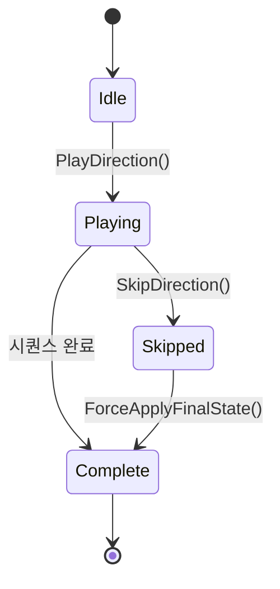

# Forge 연출/UI 구현 가이드

이 문서는 Forge 파이프라인의 연출/UI 구현 참조 가이드입니다.

> **대상**: AI 서브에이전트 및 개발자
> **목적**: Feature Spec / Element Task Doc에 정의된 수치와 파라미터를 실제 Unity C# 코드로 변환할 때 참조
> **관계**: Feature Spec → Element Task Doc → 이 가이드 참조 → 코드 구현
> **언어**: Unity C# / DOTween / Cinemachine

```
Feature Spec
    │
    ▼
Element Task Doc  (Section 16: 연출 레퍼런스 포함)
    │
    ▼
이 가이드 (패턴 참조)
    │
    ▼
코드 구현
```

---

## 목차

1. [개요](#1-개요)
2. [DOTween 구현 패턴](#2-dotween-구현-패턴)
3. [ParticleSystem 구현 패턴](#3-particlesystem-구현-패턴)
4. [카메라 연출 패턴](#4-카메라-연출-패턴)
5. [UI 전환 구현 패턴](#5-ui-전환-구현-패턴)
6. [사운드 동기화 패턴](#6-사운드-동기화-패턴)
7. [스킵/중단 구현 패턴](#7-스킵중단-구현-패턴)
8. [성능 예산 가이드라인](#8-성능-예산-가이드라인)
9. [도구 연동](#9-도구-연동)

---

## 1. 개요

### 목적

Spec 및 Element Task Doc에는 연출 수치(지속 시간, Ease 커브, 파티클 수, 사운드 타이밍 등)가 명시된다.
이 가이드는 그 수치를 Unity C# 코드로 옮기는 **패턴 레퍼런스**다. 수치 자체는 Spec을 따르고, 구조(어떻게 연결할 것인가)는 이 가이드를 따른다.

### 대상 독자

- Forge 파이프라인에서 연출 구현을 담당하는 AI 서브에이전트
- 연출/UI 구현을 맡은 개발자

### 전제 조건

| 라이브러리 | 버전 기준 | 비고 |
|-----------|---------|------|
| DOTween (Pro 권장) | 1.2+ | `using DG.Tweening;` |
| Cinemachine | 2.9+ (URP/HDRP 지원) | 카메라 연출 섹션 |
| Unity | 2021.3 LTS 이상 | |

---

## 2. DOTween 구현 패턴

> **핵심 원칙**: 모든 시퀀스는 하나의 `Sequence` 변수로 관리한다. 분산된 `DOTween.To()` 호출은 스킵 처리와 리소스 해제를 어렵게 만든다.

### 2-1. Sequence 빌더 패턴

| 메서드 | 동작 | 사용 시점 |
|--------|------|----------|
| `Append(tween)` | 직전 트윈 완료 후 순서대로 실행 | 순차 연출 |
| `Join(tween)` | 직전 `Append`와 동시 실행 | 동시 연출 (페이드 + 스케일) |
| `Insert(time, tween)` | 절대 시간(초) 위치에 삽입 | 정밀 타이밍 제어 |
| `InsertCallback(time, action)` | 절대 시간에 콜백 실행 | 사운드 트리거, 이벤트 발행 |
| `AppendCallback(action)` | 직전 트윈 완료 직후 콜백 | 상태 전환 알림 |
| `AppendInterval(seconds)` | 빈 대기 시간 삽입 | 연출 중간 일시 정지 |

### 2-2. 주요 Ease 커브 참조 테이블

| Ease 커브 | 시각적 특성 | 주요 사용처 |
|-----------|-----------|-----------|
| `Ease.OutBack` | 목표치를 살짝 초과 후 복귀 — 바운스 느낌 | 버튼 팝업, 카드 등장 |
| `Ease.InOutSine` | 시작/끝 느리고 중간 빠름 — 부드러운 곡선 | UI 슬라이드, 페이드 |
| `Ease.OutElastic` | 탄성 반동, 여러 번 진동 | 점수 팝업, 강조 효과 |
| `Ease.OutExpo` | 초반 빠르고 끝에서 급감속 | 카메라 줌, 슬래시 이동 |
| `Ease.InBack` | 반대 방향으로 예비 동작 후 가속 | 사라지는 오브젝트 |
| `Ease.Linear` | 일정 속도 | HP 바 감소, 로딩 프로그레스 |
| `Ease.Flash` | 깜빡임(반복 진동) | 피격 피드백, 경고 |

### 2-3. Kill vs Complete

| 메서드 | 동작 | 사용 시점 |
|--------|------|----------|
| `DOTween.Kill(target)` | 즉시 중단, 현재 상태 유지 | 인터럽트로 연출 취소 |
| `DOTween.Kill(target, complete: true)` | 즉시 완료 상태로 점프 | 스킵 버튼 처리 |
| `sequence.Complete()` | 해당 Sequence만 완료 점프 | 특정 시퀀스만 스킵 |
| `sequence.Pause()` / `Play()` | 일시 정지 / 재개 | 다이얼로그 도중 일시정지 |

### 2-4. 안전 패턴 (SetAutoKill / SetLink)

```csharp
// SetAutoKill(true): 완료 후 자동 해제 (기본값 true, 명시 권장)
// SetLink(gameObject): GameObject 비활성화/파괴 시 자동 Kill
sequence.SetAutoKill(true).SetLink(gameObject);
```

- `SetLink` 미사용 시: 오브젝트 파괴 후에도 트윈이 실행되어 NullReferenceException 발생
- 풀링(Object Pool) 오브젝트는 반납 시 `DOTween.Kill(target, complete: true)` 명시적 호출 필수

### 2-5. 코드 예시: 카드 플립 Sequence

```csharp
// Spec 수치 예시: flipDuration=0.4f, scaleBounce=1.1f
public Sequence PlayCardFlip(Transform card, Sprite frontSprite, float flipDuration = 0.4f)
{
    float half = flipDuration * 0.5f;
    Sequence seq = DOTween.Sequence().SetAutoKill(true).SetLink(card.gameObject);

    // 1단계: 카드 수평 축소 (뒤집기 전반)
    seq.Append(card.DOScaleX(0f, half).SetEase(Ease.InSine));

    // 앞면 스프라이트 교체 (뒤집기 중간 타이밍)
    seq.AppendCallback(() =>
    {
        card.GetComponent<SpriteRenderer>().sprite = frontSprite;
    });

    // 2단계: 카드 수평 복원 + 살짝 바운스
    seq.Append(card.DOScaleX(1f, half).SetEase(Ease.OutBack));

    // 전체 완료 후 원래 스케일 보정 (안전장치)
    seq.AppendCallback(() => card.localScale = Vector3.one);

    return seq;
}
```

**해야 할 것 / 하지 말 것**

| 해야 할 것 | 하지 말 것 |
|-----------|-----------|
| `SetLink(gameObject)` 항상 설정 | 분산된 `transform.DOMove()` 여러 개 남발 |
| Sequence 변수로 관리 (스킵 처리용) | `DOTween.KillAll()` 전역 Kill (다른 연출 영향) |
| 스킵 시 `complete: true`로 최종 상태 보장 | 코루틴과 DOTween 혼용으로 타이밍 꼬임 |

---

## 3. ParticleSystem 구현 패턴

> **핵심 원칙**: 효과 유형(Burst/Trail/Ambient)에 따라 모듈 설정이 다르다. 모바일 성능 예산 초과 시 MaxParticles와 Simulation Speed를 먼저 조정한다.

### 3-1. 효과 유형별 모듈 설정

**Burst 효과 (폭발, 등장)**

| 모듈 | 권장 설정 |
|------|---------|
| Emission | Burst: Count 20~50, Cycle 1회 |
| Lifetime | 0.3s ~ 0.8s (짧게) |
| Start Speed | 3 ~ 8 |
| Shape | Sphere / Circle (방향 퍼짐) |
| Gravity Modifier | 0.5 ~ 1.0 (자연스러운 낙하) |
| Renderer > Sorting | 레이어/Order 명시 필수 |

**Trail 효과 (궤적, 이동)**

| 모듈 | 권장 설정 |
|------|---------|
| Emission | Rate over Time 10~30 |
| Shape | Cone, Angle 5~15도 |
| Trails 모듈 | Ratio 0.3~0.6, Lifetime 0.2~0.5 |
| Color over Lifetime | Tail 쪽 알파 0으로 페이드 |
| Renderer | Trails Material 별도 설정 필수 |

**Ambient 효과 (배경, 분위기)**

| 모듈 | 권장 설정 |
|------|---------|
| Emission | Rate over Time 1~5 (낮게) |
| Lifetime | 2s ~ 5s (길게) |
| Start Speed | 0.1 ~ 0.5 (느리게) |
| Size over Lifetime | 점진적 감소 커브 |
| Color over Lifetime | 전체 구간 알파 낮게 (0.1~0.4) |

### 3-2. SubEmitter 패턴

```csharp
// SubEmitter: 파티클 사망 시점에 2차 파티클 생성 (충돌 파편 등)
// Inspector에서 Sub Emitters 모듈 활성화 후:
// - Birth: 파티클 생성 시 발동
// - Death: 파티클 소멸 시 발동 (파편 효과에 적합)
// - Collision: 충돌 시 발동
```

### 3-3. 성능 가이드라인

| 항목 | 모바일 (저사양) | 모바일 (고사양) | PC |
|------|:------------:|:------------:|:--:|
| MaxParticles (단일 시스템) | 50 이하 | 150 이하 | 500 이하 |
| 동시 활성 시스템 수 | 3개 이하 | 6개 이하 | 제한 없음 |
| Overdraw 주의 | Additive 블렌드 2레이어 이하 | 4레이어 이하 | — |
| Texture Sheet Animation | 4×4 이하 | 8×8 이하 | 제한 없음 |

**Overdraw 주의사항**: 반투명(Additive/Alpha Blend) 파티클은 겹칠수록 GPU 부하 증가. 모바일에서 동일 영역에 3레이어 이상 겹치지 않도록 설계.

### 3-4. 코드 예시: 등급별 파티클 색상 변경

```csharp
// Spec 수치 예시: 등급별 색상 배열, 파티클 개수 multiplier
public void SetParticleGrade(ParticleSystem ps, Color gradeColor, int countMultiplier = 1)
{
    var main = ps.main;
    main.startColor = gradeColor;

    var emission = ps.emission;
    // 기존 Burst 설정 유지하면서 count만 조정
    if (emission.burstCount > 0)
    {
        var burst = emission.GetBurst(0);
        burst.count = burst.count.constant * countMultiplier;
        emission.SetBurst(0, burst);
    }

    // 이미 재생 중이면 재시작
    if (ps.isPlaying)
    {
        ps.Stop(true, ParticleSystemStopBehavior.StopEmittingAndClear);
        ps.Play();
    }
}
```

**해야 할 것 / 하지 말 것**

| 해야 할 것 | 하지 말 것 |
|-----------|-----------|
| MaxParticles를 플랫폼 기준으로 설정 | `ps.emission.rateOverTime = 1000` 무제한 |
| 오브젝트 풀링으로 파티클 시스템 재사용 | 매 연출마다 `Instantiate` |
| Sorting Layer / Order in Layer 명시 | Default Layer에 전부 몰아넣기 |

---

## 4. 카메라 연출 패턴

> **핵심 원칙**: 카메라 연출은 Cinemachine Virtual Camera 전환을 기본으로 하고, 보조 피드백(셰이크)은 DOTween으로 처리한다. 두 방식을 혼용할 때 우선순위(Priority)를 명확히 한다.

### 4-1. Cinemachine Virtual Camera 전환

```csharp
// 연출용 Virtual Camera(Priority 높게) 활성화 → Blend로 부드러운 전환
public void ActivateCinematicCamera(CinemachineVirtualCamera cinematicCam,
    CinemachineVirtualCamera defaultCam, float blendDuration = 0.5f)
{
    cinematicCam.Priority = 20;   // 기본 카메라(Priority 10)보다 높게
    defaultCam.Priority = 10;

    // Cinemachine Brain의 Default Blend가 blendDuration과 맞는지 확인 필요
    // Inspector: CinemachineBrain > Default Blend Duration
}

public void DeactivateCinematicCamera(CinemachineVirtualCamera cinematicCam,
    CinemachineVirtualCamera defaultCam)
{
    cinematicCam.Priority = 0;
    defaultCam.Priority = 10;
}
```

### 4-2. DOShakePosition / DOShakeRotation (Screen Shake)

| 파라미터 | 설명 | 약한 피격 | 강한 피격 |
|---------|------|:-------:|:-------:|
| `duration` | 셰이크 지속 시간 | 0.15f | 0.3f |
| `strength` | 흔들림 강도 | 0.05f | 0.2f |
| `vibrato` | 진동 횟수 | 10 | 15 |
| `randomness` | 방향 무작위성 | 45f | 90f |

### 4-3. Zoom / Dolly 패턴

```csharp
// Zoom: FOV 변경 (원근 카메라 기준)
camera.DOFieldOfView(targetFOV, duration).SetEase(Ease.OutExpo);

// Dolly: 위치 이동 (카메라 직접 이동 또는 Follow Target 이동)
cameraTransform.DOMove(targetPosition, duration).SetEase(Ease.InOutSine);

// Orthographic Zoom (2D / UI 카메라)
camera.DOOrthoSize(targetSize, duration).SetEase(Ease.OutQuad);
```

### 4-4. 코드 예시: 결과 연출 시 카메라 셰이크

```csharp
public Sequence PlayResultShake(Camera cam, float intensity = 0.15f)
{
    Sequence seq = DOTween.Sequence().SetAutoKill(true).SetLink(cam.gameObject);

    // 셰이크 전 0.1초 대기 (임팩트 직전 찰나 정지 느낌)
    seq.AppendInterval(0.1f);

    // 메인 셰이크
    seq.Append(cam.DOShakePosition(0.3f, intensity, 15, 90f, false, true));

    // 셰이크 후 원위치 보정 (SetShake가 원위치 보장하지 않는 경우)
    seq.AppendCallback(() => cam.transform.localPosition = Vector3.zero);

    return seq;
}
```

**해야 할 것 / 하지 말 것**

| 해야 할 것 | 하지 말 것 |
|-----------|-----------|
| Cinemachine Priority로 카메라 전환 | Main Camera Transform 직접 조작 (Cinemachine 충돌) |
| 셰이크 후 `localPosition = Vector3.zero` 복원 | 셰이크 여러 개 동시 실행 (누적 오프셋) |
| `snapping: true` 옵션으로 픽셀 단위 정렬 | UI 카메라에 3D 셰이크 적용 |

---

## 5. UI 전환 구현 패턴

> **핵심 원칙**: UI 전환 중 입력 차단은 `CanvasGroup.interactable + blocksRaycasts`로 처리한다. 전환 시작 시 차단, 전환 완료 시 복원.

### 5-1. 전환 유형별 패턴

| 유형 | 메서드 | Ease 권장 |
|------|--------|---------|
| 페이드 인/아웃 | `canvasGroup.DOFade(target, duration)` | `InOutSine` |
| 스케일 팝업 | `transform.DOScale(target, duration)` | `OutBack` |
| 슬라이드 인 | `rectTransform.DOAnchorPos(target, duration)` | `OutExpo` |
| 슬라이드 아웃 | `rectTransform.DOAnchorPos(target, duration)` | `InExpo` |
| 색상 전환 | `graphic.DOColor(target, duration)` | `Linear` |

### 5-2. CanvasGroup 입력 차단 관리

```csharp
// 전환 시작 시 입력 차단
void BlockInput(CanvasGroup cg)
{
    cg.interactable = false;
    cg.blocksRaycasts = false;
}

// 전환 완료 시 입력 복원
void RestoreInput(CanvasGroup cg)
{
    cg.interactable = true;
    cg.blocksRaycasts = true;
}
```

### 5-3. UI 프레임워크별 주의사항

| 프레임워크 | 페이드 방식 | 위치 이동 | 비고 |
|-----------|-----------|---------|------|
| **uGUI** | `CanvasGroup.DOFade` | `RectTransform.DOAnchorPos` | 권장 방식 |
| **NGUI** | `UIPanel.alpha` tween | `UITweener.PlayForward/Reverse` | 레거시 프로젝트 전용 |

### 5-4. 코드 예시: 팝업 Open/Close 시퀀스

```csharp
public class PopupTransition : MonoBehaviour
{
    [SerializeField] private CanvasGroup canvasGroup;
    [SerializeField] private float openDuration = 0.3f;
    [SerializeField] private float closeDuration = 0.2f;

    private Sequence _currentSeq;

    public Sequence Open()
    {
        KillCurrent();
        BlockInput(canvasGroup);
        transform.localScale = Vector3.one * 0.85f;
        canvasGroup.alpha = 0f;

        _currentSeq = DOTween.Sequence().SetAutoKill(true).SetLink(gameObject);
        _currentSeq.Append(canvasGroup.DOFade(1f, openDuration).SetEase(Ease.InOutSine));
        _currentSeq.Join(transform.DOScale(1f, openDuration).SetEase(Ease.OutBack));
        _currentSeq.AppendCallback(() => RestoreInput(canvasGroup));

        return _currentSeq;
    }

    public Sequence Close(System.Action onComplete = null)
    {
        KillCurrent();
        BlockInput(canvasGroup);

        _currentSeq = DOTween.Sequence().SetAutoKill(true).SetLink(gameObject);
        _currentSeq.Append(canvasGroup.DOFade(0f, closeDuration).SetEase(Ease.InSine));
        _currentSeq.Join(transform.DOScale(0.9f, closeDuration).SetEase(Ease.InBack));
        _currentSeq.AppendCallback(() =>
        {
            gameObject.SetActive(false);
            onComplete?.Invoke();
        });

        return _currentSeq;
    }

    private void KillCurrent()
    {
        _currentSeq?.Kill(complete: false);
        _currentSeq = null;
    }

    private void BlockInput(CanvasGroup cg) { cg.interactable = false; cg.blocksRaycasts = false; }
    private void RestoreInput(CanvasGroup cg) { cg.interactable = true; cg.blocksRaycasts = true; }
}
```

**해야 할 것 / 하지 말 것**

| 해야 할 것 | 하지 말 것 |
|-----------|-----------|
| 전환 중 `blocksRaycasts = false`로 입력 차단 | 전환 완료 전 버튼 중복 클릭 허용 |
| `DOAnchorPos`로 RectTransform 이동 | `transform.DOMove`로 UI 이동 (레이아웃 깨짐) |
| 기존 시퀀스 Kill 후 새 시퀀스 시작 | 이전 Open 완료 전 Close 시작 |

---

## 6. 사운드 동기화 패턴

> **핵심 원칙**: 연출 타임라인의 사운드는 `InsertCallback`으로 정확한 시각에 트리거한다. BGM 전환은 별도 Sequence로 분리하여 독립 제어한다.

### 6-1. DOTween InsertCallback으로 사운드 트리거

```csharp
// 연출 시퀀스 특정 시각에 SFX 재생
seq.InsertCallback(0.1f, () => AudioManager.PlaySFX("card_flip"));
seq.InsertCallback(0.4f, () => AudioManager.PlaySFX("card_reveal"));
```

### 6-2. AudioSource 크로스페이드 패턴

```csharp
// DOTween으로 볼륨 크로스페이드 구현
IEnumerator CrossFadeBGM(AudioSource from, AudioSource to,
    float duration = 1.0f, float targetVolume = 0.8f)
{
    to.volume = 0f;
    to.Play();

    Sequence fade = DOTween.Sequence();
    fade.Append(from.DOFade(0f, duration));
    fade.Join(to.DOFade(targetVolume, duration));
    fade.AppendCallback(() => from.Stop());

    yield return fade.WaitForCompletion();
}
```

### 6-3. BGM 페이드 아웃 → SFX → BGM 복귀 시퀀스

```csharp
public Sequence PlayStingerWithBGMDuck(AudioSource bgm, AudioClip stinger,
    float duckDuration = 0.3f, float duckVolume = 0.2f, float restoreDuration = 0.5f)
{
    float originalVolume = bgm.volume;
    AudioSource stingerSource = GetAvailableAudioSource(); // 풀에서 획득

    Sequence seq = DOTween.Sequence().SetAutoKill(true);

    // BGM 볼륨 다운
    seq.Append(bgm.DOFade(duckVolume, duckDuration).SetEase(Ease.InSine));

    // 스팅어 재생 + BGM 복귀
    seq.AppendCallback(() =>
    {
        stingerSource.clip = stinger;
        stingerSource.Play();
    });
    seq.Append(bgm.DOFade(originalVolume, restoreDuration).SetEase(Ease.OutSine)
        .SetDelay(stinger.length * 0.5f)); // 스팅어 중간부터 BGM 복귀

    return seq;
}
```

### 6-4. 볼륨 커브 구현

```csharp
// AudioSource.DOFade: 볼륨을 targetVolume으로 duration 동안 트윈
audioSource.DOFade(0.0f, 1.5f).SetEase(Ease.InCubic);  // 페이드 아웃
audioSource.DOFade(0.8f, 0.5f).SetEase(Ease.OutCubic);  // 페이드 인
```

**해야 할 것 / 하지 말 것**

| 해야 할 것 | 하지 말 것 |
|-----------|-----------|
| `InsertCallback` 시각 수치는 Spec 타임라인 기준 | `Update()`에서 매 프레임 사운드 조건 체크 |
| AudioSource 풀링으로 SFX 재사용 | `AudioSource` 매번 `AddComponent` |
| BGM 볼륨 원본값 저장 후 복원 | `bgm.volume = 0.8f` 하드코딩 |

---

## 7. 스킵/중단 구현 패턴

> **핵심 원칙**: 스킵은 "건너뜀"이 아니라 "결과 상태로 즉시 전환"이다. 스킵 후 반드시 최종 결과 상태가 화면에 표시되어야 한다.

### 7-1. 스킵 동작별 메서드

| 동작 | 메서드 | 결과 상태 |
|------|--------|---------|
| 연출 스킵 (결과 보여줌) | `sequence.Kill(complete: true)` | 최종 값으로 즉시 전환 |
| 연출 취소 (원상복귀) | `sequence.Kill(complete: false)` | 현재 중간값 유지 |
| 파티클 즉시 제거 | `ps.Stop(true, StopEmittingAndClear)` | 파티클 전부 삭제 |
| 파티클 자연 소멸 | `ps.Stop(false)` | 기존 파티클 수명 완료 후 소멸 |
| 사운드 즉시 정지 | `audioSource.Stop()` | 무음 |
| 코루틴 중단 | `StopCoroutine(coroutine)` | 현재 위치 중단 |

### 7-2. 리소스 정리 체크리스트

| 리소스 유형 | 정리 방법 | 주의사항 |
|-----------|---------|---------|
| DOTween Sequence | `sequence?.Kill(complete: true)` | null 체크 필수 |
| DOTween (대상 기준) | `DOTween.Kill(target, true)` | target이 null이면 오류 |
| ParticleSystem | `ps.Stop(true, StopEmittingAndClear)` | SubEmitter도 같이 중지됨 |
| AudioSource (SFX) | `audioSource.Stop()` | 풀에 반납 처리 |
| AudioSource (BGM) | `bgm.DOFade(0, 0.1f)` 후 Stop | 급격한 컷 방지 |
| Coroutine | `StopCoroutine(ref)` | ref 보관 필수 |
| Timer / Invoke | `CancelInvoke(methodName)` | 오발 방지 |
| 이벤트 리스너 | `event -= handler` | OnDestroy에서 반드시 해제 |

### 7-3. State 복원: 스킵 후 최종 상태 보장

스킵 후 UI/오브젝트가 중간값에 멈추는 오류를 방지하기 위해, `SkipSequence()` 호출 직후 반드시 최종 상태를 명시적으로 설정한다.

```csharp
public class ResultDirector : MonoBehaviour
{
    private Sequence _directionSeq;

    [Header("최종 결과 상태 참조")]
    [SerializeField] private CanvasGroup resultPanel;
    [SerializeField] private Transform rewardIcon;

    public void StartDirection()
    {
        _directionSeq = DOTween.Sequence().SetAutoKill(false).SetLink(gameObject);

        _directionSeq.Append(resultPanel.DOFade(0f, 0f));         // 초기 숨김
        _directionSeq.Append(resultPanel.DOFade(1f, 0.5f));       // 패널 등장
        _directionSeq.Append(rewardIcon.DOScale(1f, 0.4f)
            .SetEase(Ease.OutBack).From(0f));                      // 보상 아이콘 팝업
        _directionSeq.AppendInterval(0.3f);
        _directionSeq.AppendCallback(OnDirectionComplete);
    }

    public void SkipDirection()
    {
        // 1. 시퀀스 Kill (완료 상태로)
        _directionSeq?.Kill(complete: true);
        _directionSeq = null;

        // 2. 최종 상태 명시적 설정 (Kill이 완료 보장 못 할 때 대비)
        resultPanel.alpha = 1f;
        rewardIcon.localScale = Vector3.one;

        // 3. 파티클/사운드 정리
        // (각 시스템의 참조가 있으면 여기서 Stop 처리)

        // 4. 완료 콜백 직접 호출
        OnDirectionComplete();
    }

    private void OnDirectionComplete()
    {
        // 결과 확인 버튼 활성화 등 후처리
    }

    private void OnDestroy()
    {
        _directionSeq?.Kill();
    }
}
```

**해야 할 것 / 하지 말 것**

| 해야 할 것 | 하지 말 것 |
|-----------|-----------|
| 스킵 후 최종 상태 명시적 설정 | `Kill(complete: true)`만 믿고 상태 미설정 |
| `OnDestroy`에서 `sequence?.Kill()` | 씬 전환 시 트윈 좀비 방치 |
| 스킵 가능 여부 플래그(`_isSkippable`)로 제어 | 아무 때나 스킵 가능해서 연출 도중 상태 꼬임 |

---

## 8. 성능 예산 가이드라인

> **핵심 원칙**: 연출 예산은 Spec의 "Tier" 정의를 따른다. Tier 정의가 없으면 아래 기준을 기본값으로 사용한다.

### 8-1. 플랫폼별 기준 테이블

| 항목 | Mobile (저사양) | Mobile (고사양) | PC |
|------|:--------------:|:--------------:|:--:|
| DrawCall 예산 (연출 중 추가분) | +10 이하 | +25 이하 | +50 이하 |
| 동시 파티클 수 (전체) | 100 이하 | 300 이하 | 1,000 이하 |
| 텍스처 메모리 (연출 에셋) | 32MB 이하 | 64MB 이하 | 256MB 이하 |
| GC Alloc/frame (연출 중) | 0KB 목표 | 0KB 목표 | 4KB 이하 |
| 목표 프레임률 | 30fps 유지 | 60fps 유지 | 60fps+ 유지 |

### 8-2. 연출 복잡도 Tier별 예산

| Tier | 설명 | DrawCall 추가 | 파티클 수 | 예시 |
|------|------|:-----------:|:-------:|------|
| **Tier 1** | 단순 트윈/페이드 | +2 이하 | 0 | 버튼 팝업, 페이드 전환 |
| **Tier 2** | 트윈 + 파티클 | +5 이하 | 30 이하 | 카드 등장, 아이템 획득 |
| **Tier 3** | 풀 연출 (트윈+파티클+사운드+카메라) | +15 이하 | 100 이하 | 스테이지 클리어, 특수 스킬 |

### 8-3. GC 회피 패턴

```csharp
// 1. 오브젝트 풀링 — Instantiate/Destroy 대신 재사용
ParticleSystem GetFromPool() { /* 풀 반환 */ }
void ReturnToPool(ParticleSystem ps)
{
    ps.Stop(true, ParticleSystemStopBehavior.StopEmittingAndClear);
    /* 풀 반납 */
}

// 2. 람다 캡처 주의 — 루프 내 람다는 변수 캡처로 GC 발생
// BAD: 매 호출마다 클로저 할당
seq.AppendCallback(() => Debug.Log(someString + i));

// GOOD: 미리 캐싱하거나 delegate 변수 재사용
System.Action cachedCallback = OnSequenceComplete;
seq.AppendCallback(cachedCallback);

// 3. string concat 주의 — 연출 루프에서 string 조합 금지
// BAD:
string key = "sfx_" + grade.ToString();  // GC 발생
// GOOD:
AudioManager.PlaySFX(gradeKey);  // 미리 캐싱된 키 사용
```

### 8-4. Unity Profiler 측정 방법

1. **Development Build 설정**: Edit > Project Settings > Player > `Development Build` 체크
2. **연출 구간 마킹**:
   ```csharp
   using Unity.Profiling;
   static readonly ProfilerMarker s_DirectionMarker = new ProfilerMarker("Direction.Play");

   public void PlayDirection()
   {
       using (s_DirectionMarker.Auto())
       {
           // 연출 시작 코드
       }
   }
   ```
3. **확인 항목**: Window > Analysis > Profiler > CPU Usage에서 `Direction.Play` 마커 검색
4. **GC Alloc 확인**: Profiler > Memory 탭 > GC Allocated 컬럼에서 연출 구간 0KB 목표 확인

**해야 할 것 / 하지 말 것**

| 해야 할 것 | 하지 말 것 |
|-----------|-----------|
| 연출 시작/끝에 ProfilerMarker 추가 | 출시 빌드에서 Deep Profile 활성화 |
| 파티클 시스템 오브젝트 풀링 | 연출마다 `Instantiate` / `Destroy` |
| Tier 정의 기반 DrawCall 예산 준수 | Tier 없이 무제한 연출 추가 |

---

## 9. 도구 연동

### 9-1. /video-reference-guide 출력물 → Element Task Doc 삽입

`/video-reference-guide` 스킬 실행 후 출력된 레퍼런스 요약을 Element Task Doc **Section 16 (연출 레퍼런스)**에 삽입하는 방법:

```markdown
## Section 16: 연출 레퍼런스

### 영상 레퍼런스 (video-reference-guide 출력)
| 항목 | 내용 |
|------|------|
| 레퍼런스 영상 | [영상 제목](URL) |
| 주목할 연출 구간 | 00:32 ~ 00:45 — 카드 등장 시퀀스 |
| 적용 패턴 | DOTween Sequence (이 가이드 섹션 2 참조) |
| Ease 커브 | OutBack (바운스) |
| 연출 지속 시간 | 0.4s |
| 파티클 사용 여부 | Burst 효과, MaxParticles 30 |
```

### 9-2. /screenshot-analyze 출력물 → Element Task Doc 삽입

`/screenshot-analyze` 스킬 실행 후 분석 결과를 Element Task Doc **Section 16**에 삽입하는 방법:

```markdown
### 스크린샷 분석 (screenshot-analyze 출력)
| 항목 | 분석 결과 |
|------|---------|
| 분석 대상 | 경쟁작 결과 화면 스크린샷 |
| UI 레이아웃 | 중앙 보상 아이콘 + 하단 확인 버튼 |
| 전환 유형 추정 | Scale 팝업 (OutBack) + 페이드 배경 |
| 파티클 밀도 추정 | Tier 2 (트윈+파티클, MaxParticles ~50) |
| 구현 참조 섹션 | 섹션 3 (Burst 효과) + 섹션 5 (팝업 패턴) |
```

### 9-3. /game-logic-visualize → FSM 연출 상태 시각화

연출 상태 기계(FSM)가 복잡할 경우 `/game-logic-visualize` 스킬로 다이어그램을 생성하고 Element Task Doc에 첨부한다.
노드 5개 이하의 단순 FSM은 Mermaid 인라인으로 작성한다.



---

*Last Updated: 2026-03-25*
*Forge 파이프라인 공유 가이드 — 프로젝트 무관 범용 패턴*
